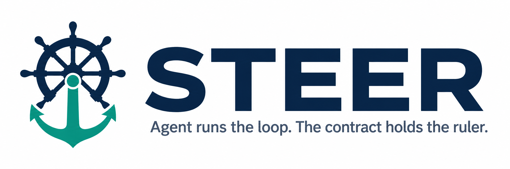
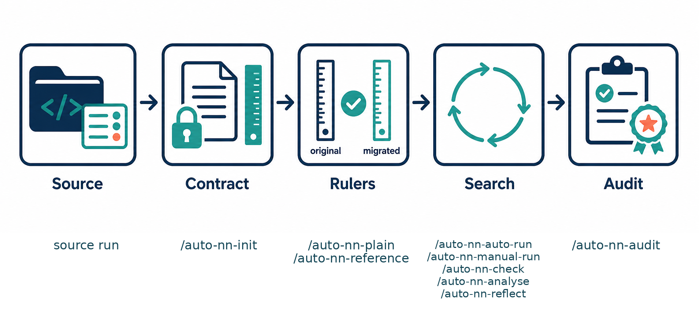
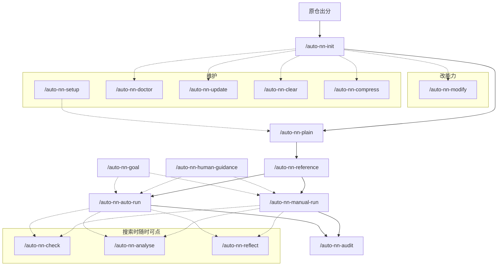
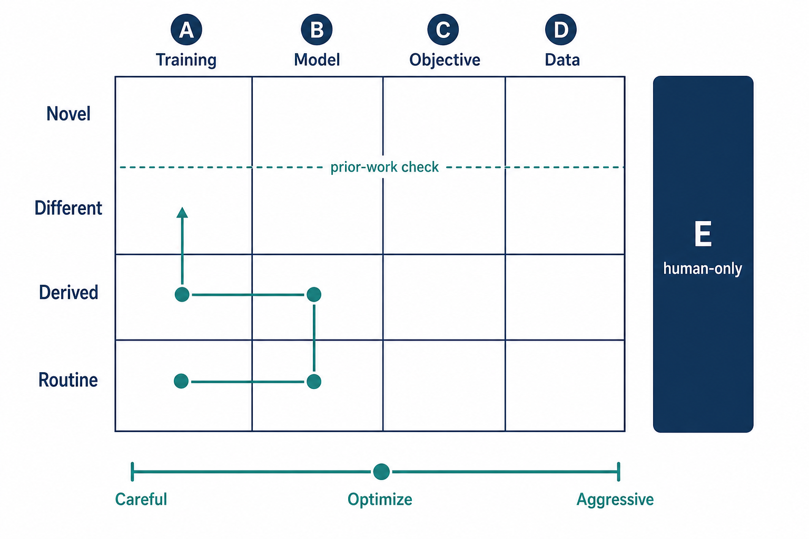

<p align="center">
  <picture>
    <source media="(prefers-color-scheme: dark)" srcset=".github/assets/logo-dark.png">
    
  </picture>
</p>

<p align="center">
  <b>STEER</b>（Steerable and Traceable autonomous Experimentation for Evidence-governed AI Research；可引导、可追溯、证据治理下的自主实验）—— 面向 AI4R（AI for Research）的实验框架，用于自主研究（autonomous research / auto-research）：把各领域已有项目接进来，让 Agent 在<strong>治理（governance）</strong>围栏里改代码、跑训练。<br>
  任务是什么、怎么打分、证据怎么留，由你定死。Agent 只改实现，不改考卷。在 Cursor 或 Claude Code 里安装后使用。
</p>

[English](README.md) · [简体中文](README-zh.md)

[](LICENSE)
[](CHANGELOG.md)
[](template/package/pyproject.toml)
[](#快速开始)

[这是什么](#这是什么) · [快速开始](#快速开始) · [接进来长什么样](#接进来长什么样) · [怎么运转](#怎么运转) · [17 个技能](#17-个技能) · [探索空间](#探索空间) · [附录](#附录)

---

## 这是什么

把你自己的研究项目接进来。各项目保留自己的任务和打分方式，不收成一张公共榜。
Agent 可以改训练代码、一轮一轮跑。它**不能**事后改任务定义、官方测试或成绩表。

这就是**治理（governance）**：Agent 负责搜索；题目、官方测试和证据由你冻住。体检、目标、人的路线图、审查后由人盖章，都是同一道围栏。论文讲的是这层主张；本仓库是实现，不是论文本身。

| 维度 | 说明 |
|---|---|
| 怎么进来 | 已有训练代码、现成训练框架、或以数据为主。 |
| 训练范式 | 有监督、强化学习、方程或场约束（物理仿真）。 |
| 走过的场景 | 图像分类、持续学习、表格建模、物理仿真、连续控制、语言模型、无线通信。这是**领域例子**，说明同一套流程能进不同课题，不是一份固定考卷。项目内部怎么分「官方实验设定」，见[场景](#场景)。上手仍用图像分类走一遍。 |

<p align="center">
  
</p>

一次实验五步：源仓出分 → 立项把任务和评价冻成合同 → 立朴素下界和公开对照 → 搜索（自动多轮或手跑）→ 审查复现、多种子，由人盖章。Agent 只改实现，尺子不在它手里。冻住的合同、可写的工作区、成绩表、以及把这些角色拆开的技能，就是搜索外面的治理围栏。

| 部分 | 作用 |
|---|---|
| 合同（`contract/`） | 任务、数据范围、主指标、评估方式、单轮时长由你定死；Agent 只能读。立项还会问**信息权限**：训练能看什么、官方分必须怎么算。 |
| 工作区（`workspace/`） | Agent 唯一能写代码的地方。 |
| 成绩表（`_runs/`） | 每一轮留下改动、日志和分数。 |
| 对照，然后审查 | 先跑一个最简单还能打分的方法（下界），再在本机复现一个公开方法（对照）。搜完后对当前最好做[审查](#audit)：**留不留由你说**。 |

本仓库是**模板**。实验在旁边另开的项目目录里做。分卷、审查、体检、换机见[怎么运转](#怎么运转)。

---

## 快速开始

### 你需要准备什么

| 需要 | 说明 |
|---|---|
| Linux 或 macOS | 安装和训练按 Unix 环境来。 |
| `git`、`bash`、Python 3.10 及以上 | 克隆模板、安装技能、跑训练。 |
| [Poetry](https://python-poetry.org/) | 接进来的项目用 Poetry 管 Python 依赖。 |
| [Cursor](https://cursor.com) 或 [Claude Code](https://claude.com/product/claude-code) | 在对话里输入 `/auto-nn-init`、`/auto-nn-auto-run` 等。 |
| GPU（可选） | 想限占用再在家目录建 `~/.gpus`（如 `0,1`）。没建就不限制。 |

这个模板**克隆并安装一次**即可。不要在模板目录里做实验。

```bash
git clone https://gitee.com/xieyulai/steer.git
# git clone https://github.com/xieyulai/steer.git
cd steer
./install.sh            # --dry-run 只预览；--uninstall 卸载
```

技能会链到 `~/.cursor/skills/` 和 `~/.claude/skills/`。你的实验项目里不会再拷一份 `skills/`。

### 推荐做法：把已有训练代码接进来

不要从空目录让 Agent 凭空开训。
先有一个已经能训练的仓库，在**这台机器**上跑出分数，再接进来。

下面用公开的 [kuangliu/pytorch-cifar](https://github.com/kuangliu/pytorch-cifar)（CIFAR-10）当**原始仓库**走一遍。
想看已经接好的项目，见 [xieyulai/steer-cifar](https://github.com/xieyulai/steer-cifar)。你自己的代码按同样顺序即可。

#### 1. 先在原仓库、本机跑出分数

克隆你要接入的训练仓库（CIFAR 原始仓：[kuangliu/pytorch-cifar](https://github.com/kuangliu/pytorch-cifar)）。按**原仓库** README，用作者的训练入口在本机跑一遍，记下官方测试分数。**不要**从论文里抄一个数字当成「我们的成绩」。

#### 2. 对原仓库跑 `/auto-nn-init`

技能装好后，在 Cursor 或 Claude Code 里（不要自己建目录、也不要打开本模板去训）：

```text
/auto-nn-init <你的仓库路径>
```

`<你的仓库路径>` 就是原训练项目（CIFAR 这条线是 [pytorch-cifar](https://github.com/kuangliu/pytorch-cifar) 的克隆目录，不是 steer-cifar）。没有旧代码时，换成你打算放新项目的位置。原仓库保持只读；接好的项目在**旁边的新目录**（Agent 会告诉你路径）。后面几步都在那个新目录里用技能做。

Agent 会一题一轮问完口径（迁入 **27** 问，从零立项 **24** 问），按主题走：对齐理解 → 场景与数据 → **信息权限**（训练能看什么、官方分怎么算、还有没有别的规矩）→ 训练与目标 → 成绩怎么记 → 运行设置。拿不准见文末[附录](#init-qa)；信息权限三问见[附录这一节](#init-qa-info)。迁入时能跟原仓库的跟原仓库。

#### 3. 先立下界，再立公开对照

在新项目里、在 Agent 对话中，**按这个顺序**：

| 你想做的 | 技能 | 实际在干什么 |
|---|---|---|
| 一个最简单、但仍遵守已定任务的方法 | `/auto-nn-plain` | 在本项目里跑一个容易实现的方法，当作下界。不要为了「简单」去改任务合同。 |
| 一个公开方法作对照 | `/auto-nn-reference` | 在本项目里复现公开方法。有原仓库时：本机原入口的分数 和 接进来之后的复现必须对得上，才能采用文献数字。对不上就改接过来的配方，不要把论文分数填进去。 |

这两步都不会改「当前最好」。每个任务场景各最多一把下界、一把公开对照。

#### 4. 开始实验

| 你想做的 | 技能 |
|---|---|
| 目标分数 / 搜索可以走多远 | `/auto-nn-goal` |
| 你希望 Agent 遵守的说明 | `/auto-nn-human-guidance` |
| 连续自动跑多轮 | `/auto-nn-auto-run` |
| 自己盯着跑一轮（或几路并行） | `/auto-nn-manual-run` |
| 看成绩表 | `/auto-nn-check` · `/auto-nn-analyse` |
| 只想、不训练 | `/auto-nn-reflect` |

#### 5. 用审查收尾

```text
/auto-nn-audit
```

对当前最好：再训一遍看能不能复现、换几个随机种子、若判断为新且复现成立再拆零件看是哪一块在起作用。
这些跑次**不会**写进成绩表。Agent 会问你：**留下 / 先搁着 / 驳回**，不会替你填。详见[审查](#audit)。

完整顺序就是：原仓出分 → 把项目接进来 → 下界 + 公开对照 → 搜索 → 审查。

---

## 接进来长什么样

CIFAR 这条线：**原始训练仓**是 [kuangliu/pytorch-cifar](https://github.com/kuangliu/pytorch-cifar)；接好之后的**示例仓**是 [xieyulai/steer-cifar](https://github.com/xieyulai/steer-cifar)。

<p align="center">
  
</p>

[steer-cifar](https://github.com/xieyulai/steer-cifar) 上约 20 轮的一条轨迹。浅蓝点是各轮尝试（有的轮两个点，双路并行）；深蓝阶梯线是到目前为止最好，只升不降；黑色点线是朴素下界（约 0.951）；蓝色虚线是公开对照（约 0.9585）。前几轮就超过两把尺子，中段爬到约 97.7% 后进入平台——后面还有尝试，但没再抬高那条深蓝线。

---

## 怎么运转

上手不必先读完。治理就是搜索外面的围栏。这里只分清四件事：项目里怎么分卷、怎么审查当前最好、结构健不健康、换机还是拉模板。

| 想弄清 | 看 |
|---|---|
| 官方实验设定怎么分开记分 | [场景](#场景) |
| 当前最好靠不靠谱、留不留 | [审查](#audit) |
| 这个项目还能不能跑 | [体检](#doctor) |
| 换机器 / 模板有新版本 | [换机与拉模板](#setup-update) |

<a id="场景"></a>

### 场景

一个项目里，一套官方实验设定叫一个**场景**：测谁、默认怎么跑。成绩按场景分开记、分开比——场景里的分数可以比，场景之间不能混成「谁更好」。

- **只有一种官方测法：** 清单里记一条就够（CIFAR 上手常常就是这样）。
- **论文规定好几套：** 几种设定就记几行。当前最好、朴素下界、公开对照都按套各算各的；目标分数也可以按套分开定。
- **多套一起搜：** 一次盯一套，或按清单轮着跑。
- **立项后再加新设定：** 用 `/auto-nn-modify`，不是日常扫参。立项时怎么问，见[附录](#init-qa)。

上面「走过的场景」是领域例子；这里说的是**接进来之后，这个项目内部怎么分卷**。

<a id="audit"></a>

### 审查

搜索是在成绩表上找更好；审查是对已经最好的那次（或你指定的一次）做一次**不入账**的复核。搜中、搜后都能跑，不必等预算用尽。技能：`/auto-nn-audit`。

- **复现：** 同样配方再训一遍，看分数是否还在。
- **多种子：** 换几个随机种子，看是不是一次运气。
- **拆零件：** 先看够不够新；只有判定为新、而且复现成立，才拆开看是哪一块在起作用。审的是公开对照时，跳过「新不新」和拆零件。
- **不进成绩表。** 这些跑次不改当前最好。结论写成审查卡片，Agent 问你：**留下 / 先搁着 / 驳回**，不替你填。
- **不是：** [仓结构体检](#doctor)，也不是下一轮该试什么（`/auto-nn-reflect`）。

还没立下界或公开对照时，卡片不算正式，会提醒你先立尺。

<a id="doctor"></a>

### 体检

审查问「这次最好靠不靠谱」；体检问「**这个项目还能不能正常跑**」，不看分数好不好（那是 `/auto-nn-analyse`）。技能：`/auto-nn-doctor`。

- **看什么：** 目录齐不齐、合同和工作区有没有被改坏、成绩表表头对不对、训练代码有没有偷偷写死参数或把错误吞掉、和模板版本是否还对得上。
- **结论三档：** 通过 / 提醒（不挡继续训）/ 不通过（先修）。贴报告前会先说一句人话结论。
- **默认轻量**（只静态看）；你要迁完验收或「含短训」再开深度档。
- **只报不改。** 不替你改代码，也不替你删运行残留（清理走 `/auto-nn-clear`）。
- **顺着修：** 模板版本旧 → `/auto-nn-update`；这台机器缺 PyTorch / 驱动对不上 → `/auto-nn-setup`。见下面[换机与拉模板](#setup-update)。

<a id="setup-update"></a>

### 换机与拉模板

三个技能都在**已经接好的项目**里说，不要在本模板（STEER）目录里跑。

| 你遇到的 | 用哪个 |
|---|---|
| 换机器、重装系统、虚拟环境丢了、torch 和这台卡的驱动对不上 | `/auto-nn-setup` |
| STEER 模板有了新修复，已接好的项目要对齐 | `/auto-nn-update` |
| 目录 / 合同 / 成绩表表头像坏了，或改完代码想确认还能跑 | `/auto-nn-doctor`（[体检](#doctor)） |

**`/auto-nn-setup`**：修的是**这台机器**能不能训。按驱动选匹配的 torch、装依赖（慢会换国内源再试）、若你家目录有允许用的显卡名单则和本机实有的卡取交集。失败会把刚改过的依赖文件还原。不拉模板新功能，也不立项。

**`/auto-nn-update`**：把**已经 git pull 过的这份 STEER 模板**里的修复拷进当前项目（工作区代码和合同正文不动）。跑完会做一次体检，有不通过就停。同机模板还没 pull 时，跟 Agent 说一声即可。不要在 STEER 仓库根目录发起。

**不要混：** 训不起来先 setup；模板变了再 update；只想听「结构还健不健康」用 doctor（它只报不修）。新课题仍走 `/auto-nn-init`。

---

## 17 个技能

实线是常见顺序。虚线是「需要时再点」，不是必经。下面总表按阶段排；细则链到[怎么运转](#怎么运转)或[附录](#附录)。



| 阶段 | 技能 | 用来做什么 |
|---|---|---|
| 立项 | `/auto-nn-init` | 把新项目或已有代码接进来。二十几问见[附录](#init-qa)。 |
| 立尺 | `/auto-nn-plain` | 跑最简单还能打分的方法，当下界。 |
| 立尺 | `/auto-nn-reference` | 立公开对照；有原仓库时先在本机对齐。 |
| 搜索 | `/auto-nn-goal` | 目标分数、主指标和搜索风格。[附录：探索风格](#explore-style) · [附录：项目配置](#nn-config) |
| 搜索 | `/auto-nn-human-guidance` | 写下 Agent 必须遵守的说明。[附录：人类说明](#human-guidance) |
| 搜索 | `/auto-nn-auto-run` | 连续自动多轮。 |
| 搜索 | `/auto-nn-manual-run` | 手跑一轮或多路并行。 |
| 搜索 | `/auto-nn-check` | 抽看成绩表。 |
| 搜索 | `/auto-nn-analyse` | 只读：这几轮发生了什么、有没有卡住。 |
| 搜索 | `/auto-nn-reflect` | 只想、不训练。[附录：反思](#reflect) |
| 审查 | `/auto-nn-audit` | 复现、多种子、拆零件；由你决定。[审查](#audit) |
| 改能力 | `/auto-nn-modify` | 改项目**允许做的事**（指标、场景、模型、损失），不是日常扫参。 |
| 维护 | `/auto-nn-setup` | 换机 / 重装后把这台机器调到能训。[换机与拉模板](#setup-update) |
| 维护 | `/auto-nn-update` | 把模板修复同步进已经接好的项目。[换机与拉模板](#setup-update) |
| 维护 | `/auto-nn-doctor` | 检查项目还能不能跑，不看分数。[体检](#doctor) |
| 维护 | `/auto-nn-clear` | 清理试跑残留（先出计划再删）。 |
| 维护 | `/auto-nn-compress` | 把过长的经验记录收短。 |

---

## 探索空间

<p align="center">
  
</p>

横轴是改哪一层（训练、模型、目标、数据），纵轴是改多深（从下到上：常规 → 派生 → 换法 → 自称新颖）。绿点连线表示搜索多半先在训练和模型的浅层走动，偶尔才往上探。虚线是文献检查：可以声称走得深，但不等于发了新颖证书。右边竖条在格子外面：改题面只能人点头，Agent 不能自己换考卷。底下的风格条见[附录：探索风格](#explore-style)。

---

## 附录

上手不必先读完。按实验顺序：立项 → 风格与配置 → 你给 Agent 的说明 → 反思。

| 块 | 内容 |
|---|---|
| [立项会问什么](#init-qa) | 迁入 27 问 / 从零 24 问；含信息权限 |
| [探索风格](#explore-style) | 谨慎 / 优化 / 创新 / 进取 / 摸底 / 自动换挡 |
| [项目配置](#nn-config) | 接好后的 `nn-config.yaml`（目标分 / 指标 / 场景），用哪个技能改 |
| [人类说明](#human-guidance) | 公平约束和分阶段计划 |
| [反思](#reflect) | 只想不训练；检索怎么配 |

<a id="init-qa"></a>

### 立项会问什么

对话里仍是一题一轮。迁入已有代码 **27** 问；从零立项 **24** 问（没有「旧资产」三步）。迁入时能跟原仓库的跟原仓库。

| 步（迁入） | 主题 | 在问什么 |
|-----------|------|----------|
| 准备 | 对齐理解 | 任务、数据、怎么打分、改码能碰多深（不计入 27） |
| 1–2 | 场景与数据 | 有哪些官方实验设定、训练/验证/终评怎么分 |
| 3–5 | **信息权限** | 训练能碰哪些材料、官方分必须怎么算、还有没有别的规矩 |
| 6–7 | 场景与数据（续） | 加载和增强写在哪、复现锁哪套数据 |
| 8–10 | 旧资产清理 | 旧成绩、旧笔记、旧文档硬规矩（**仅迁入**；从零没有这三步） |
| 11–12 | 训练方式 | 训练目标什么能动、循环怎么转 |
| 13 | 主指标 | 主分、辅分叫什么 |
| 14–15 | 实验目标 | 这轮干什么、主分到多少算达标停 |
| 16–23 | 评估与成绩记录 | 成绩表怎么记、训中/训后怎么打分、怎么算更好 |
| 24–27 | 运行设置 | 训练时长、显卡、两把尺、随机种子 |
| 末 | 口径汇总 | 锁定口径，**不是**迁完 |

#### 对齐理解

| 迁入 | 从零 | 问什么 | 这一步在定什么 | 怎么答 / 拿不准 |
|------|------|--------|----------------|-----------------|
| 前 | 前 | 我对项目的理解对吗？ | 任务、数据、怎么打分、改码能碰多深 | 对就继续；有偏差直接改那几条。不要跳过。 |

#### 场景与数据

| 迁入 | 从零 | 问什么 | 这一步在定什么 | 怎么答 / 拿不准 |
|------|------|--------|----------------|-----------------|
| 1 | 1 | 有哪几种官方实验设定？ | 以后成绩按哪几套场景分开记、各自起跑配置 | 列「测谁 + 默认怎么跑」。几种官方设定就记几套。迁入跟源仓。 |
| 2 | 2 | 训练 / 验证 / 终评怎么分？ | 终评用哪份数据，和训练能不能看见它 | 常见：训练份训、验证份看过程、测试份只终评。迁入跟源仓。 |

<a id="init-qa-info"></a>

#### 信息权限

答完写进合同，开训按这个拦。

| 迁入 | 从零 | 问什么 | 这一步在定什么 | 怎么答 / 拿不准 |
|------|------|--------|----------------|-----------------|
| 3 | 3 | 训练能碰哪些材料？ | 哪些数据训练可以用，哪些只能打分时打开 | 训练只能用训练该用的材料；只用来打分的，打分时才打开。没有只评材料就选没有。训练完全不读数据文件再选第三种。迁入跟源仓。 |
| 4 | 4 | 官方分必须怎么算？ | 官方分只能走哪条路，不许绕开 | 多数任务选「模型看输入直接出结果」。官方分必须走规定手续、不能换一条路来算，选受限路径；必须在指定状态下打分，选固定评测态。迁入跟源仓。 |
| 5 | 5 | 还有别的信息不许乱流吗？ | 除上面两条外还有没有规矩 | 没有就选没有。有再逐条说。 |

#### 场景与数据（续）

| 迁入 | 从零 | 问什么 | 这一步在定什么 | 怎么答 / 拿不准 |
|------|------|--------|----------------|-----------------|
| 6 | 6 | 数据加载和增强写在哪？ | 实现层怎么读数据、做增强 | 按 Agent 读代码的建议。增强一般放可改的实现里，不要写进冻结的口径文件。 |
| 7 | 7 | 复现时锁哪套数据？ | 换机器还能找到同一份数据 | 写清数据根路径或版本。没有版本就写现在用的目录。 |

#### 旧资产清理（仅迁入）

从零立项没有这三步，后面步号少 3。

| 迁入 | 从零 | 问什么 | 这一步在定什么 | 怎么答 / 拿不准 |
|------|------|--------|----------------|-----------------|
| 8 | — | 旧成绩表和实验目录要不要带？ | 新项目要不要旧数字 | 新开一般不带，从零记。还要对照旧分再选带过来。 |
| 9 | — | 旧踩坑笔记要不要？ | 经验文档留、重写还是丢掉 | 新开可重写。旧笔记仍有用就摘重点带过去。 |
| 10 | — | 旧文档里的硬规矩留不留？ | 例如「必须用某优化器」还管不管 | 仍要遵守就留下；只是当时习惯就丢掉。 |

#### 训练方式

| 迁入 | 从零 | 问什么 | 这一步在定什么 | 怎么答 / 拿不准 |
|------|------|--------|----------------|-----------------|
| 11 | 8 | 训练目标什么能动、什么碰不得？ | **不是**问现在用哪个损失，是定以后自动改实验时的底线 | 听 Agent 建议的「必须留 / 可以换 / 可以加 / 只能拧旋钮」。按任务底线定。 |
| 12 | 9 | 训练循环怎么转？ | 几层循环、一圈后何时打分 | 按 Agent 从代码画出的流程。迁入跟源仓。 |

#### 主指标

| 迁入 | 从零 | 问什么 | 这一步在定什么 | 怎么答 / 拿不准 |
|------|------|--------|----------------|-----------------|
| 13 | 10 | 主分、辅分叫什么？ | 成绩表上哪个数用来比好坏 | 主分就是用来比好坏的那个数；辅分是顺便看的。迁入跟源仓。 |

#### 实验目标

| 迁入 | 从零 | 问什么 | 这一步在定什么 | 怎么答 / 拿不准 |
|------|------|--------|----------------|-----------------|
| 14 | 11 | 这轮主要干什么？ | 追分、也试新方法、还是先摸底 | **拿不准选「先把主指标做上去」。** 要逼新方法再选更深一档；只摸底、先不设达标线选摸底。一般不必选「照手册完全不动」。 |
| 15 | 12 | 主分到多少算达标停？ | 最终目标，不是「单次算不算进步」 | **拿不准选「暂不设」。** 摸底档只问护栏、不设主目标。 |

#### 评估与成绩记录

| 迁入 | 从零 | 问什么 | 这一步在定什么 | 怎么答 / 拿不准 |
|------|------|--------|----------------|-----------------|
| 16 | 13 | 哪些分进成绩表主列？ | 主列 vs 备注列 | 主分进主列；偶尔看的进备注。按建议即可。 |
| 17 | 14 | 训**结束后**正式打分怎么跑？ | 和上面「官方分必须怎么算」必须一致 | 训完按合同规定的官方通道跑一次终评。迁入跟源仓。 |
| 18 | 15 | 训练**过程中**要不要打分？ | 每圈都评、训中不评、还是隔几圈评 | 可以每圈看一份过程分；特别慢再稀疏评。迁入跟源仓。 |
| 19 | 16 | 成绩表要哪些列？ | 表头分几块、固定带对照角色列 | 按建议。不要为了好看加一堆空列。 |
| 20 | 17 | 每轮允许改什么、多场景怎么比？ | 探索规则，不是再问「要不要探索」 | **推荐：每轮只改一样；多个场景的最好成绩分开比。** 不要一轮同时改架构又改学习率。 |
| 21 | 18 | 哪些超参要记进成绩表？ | 事后能对照是哪组设置跑出来的 | 学习率、批大小、种子等常改的记下。按建议勾。 |
| 22 | 19 | 权重存最好的还是最后一轮？ | 出问题能否回放那次模型 | 一般存验证最好的那一轮。磁盘紧再只存最后一轮。 |
| 23 | 20 | 单次比历史最好涨多少才留下？ | 和「最终达标停」是两条线 | 设太严后面很多轮都留不下。拿不准用刚能分辨「这次确实更好」的最小幅度；听 Agent 建议。 |

#### 运行设置

| 迁入 | 从零 | 问什么 | 这一步在定什么 | 怎么答 / 拿不准 |
|------|------|--------|----------------|-----------------|
| 24 | 21 | 单次训练最长跑多久？ | 超时就停，避免卡死 | 按你机器和数据填秒数。先试通可短一点；正式搜再加长。0 = 不限（慎用）。 |
| 25 | 22 | 用哪些显卡、最多同时几路？ | 项目里的卡名单和并行路数 | 想限制占用：先在家目录建允许用的显卡名单，这里填和本机对得上的那些。没建名单就不限制，可填本机全部或先空着。并行不要超过名单张数。 |
| 26 | 23 | 开跑前要不要先立两把尺？ | 该场景的朴素下界和公开对照 | **推荐两把都立**（最傻方法 + 公开对照）。找不到公开方法就说没有，让 Agent 稍后从已有成绩里挑。 |
| 27 | 24 | 随机种子定多少？ | 复现时能不能跑出接近的数 | 常用 **42**。要多种子稳健性再另说，不必在这一步一次定完。 |

#### 口径汇总

| 迁入 | 从零 | 问什么 | 这一步在定什么 | 怎么答 / 拿不准 |
|------|------|--------|----------------|-----------------|
| 末 | 末 | 口径汇总，请最终确认 | 只锁定口径，**不是**迁完 | 看总表。不对就指出哪一行。确认后 Agent 才改代码；真正完成还要短训能跑通。 |

<a id="explore-style"></a>

### 探索风格

拧哪一档，决定这一轮敢改多深、查不查论文、主分到了要不要停。日常用 **`/auto-nn-goal`** 说「换成优化 / 创新 / 摸底」即可，不必手改配置。检索深浅见[附录：反思](#reflect)。

| 风格 | 在干什么 | 到目标停不停 | 检索大概怎样 |
|------|----------|----------------|----------------|
| 谨慎 | 照现成做，从训练旋钮这类浅层起；涨得比较明显才留下 | 停 | 几乎不查论文 |
| 优化（默认） | 冲主分，模型和训练都可以动 | 停 | 浅查文档和常见库 |
| 创新 | 允许更深的方法；撞墙时翻公开实现 | 停 | 查论文和公开代码 |
| 进取 | 搜得最开，连数据层也可以动 | 停 | 加深，必要时读全文 |
| 摸底 | 先铺开试方法，不被分数卡住 | **不停** | 同创新 |
| 自动换挡 | 从优化起；连续 5 轮没涨就升到创新，再进取，不退回 | 跟随当前档 | 跟随当前档 |

「自动换挡」升档链是 **优化 → 创新 → 进取**（不会升到摸底）。想停自动升档，再拧回某一档显式风格。

<a id="nn-config"></a>

### 项目配置（`nn-config.yaml`）

接好的项目根上有一份 **`nn-config.yaml`**。立项之后这里**必须**有：达标分数、盯哪一个主指标、默认盯哪一套场景。探索风格一选定，留下多少、隔几轮反思、查多深的论文，按该档自动补上，不必在文件里逐项开。

日常用 **`/auto-nn-goal`** 改目标和风格，不要手改。下面是 [steer-cifar](https://github.com/xieyulai/steer-cifar) 接好之后的样子（数字和场景名是那个项目的；你的会不同）。

```yaml
profile: supervised
gpus: [0, 1]                 # 项目卡名单；你的机器另填。开训另读 ~/.gpus
max_parallel: 2
device: auto
time_budget: 7200          # 单次训练最长秒数
seed: 42
deterministic: true
checkpoint: best
exploration_mode: innovate # 探索风格，见上一节
early_stop:
  patience: 0
goal:
  target: 0.99             # 主分到多少算达标停（必须是数字）
  metric: val_accuracy      # 盯哪个主指标；须在合同指标名单里
  op: '>='                 # 越大越好；越小越好写成 '<='
  policy: focus            # 只盯下面这个默认场景停
agent:
  scenario_default: cifar10_autonomous   # 默认盯哪一套；空则体检不通过
  # scenario_active: cifar10_autonomous  # 多套一起搜时再列清单
```

合同里还规定了主指标方向（这份例子是验证准确率、越大越好）。多套官方设定时，成绩仍按场景分开记；yaml 只写「现在默认盯哪一套」。

**用技能改，不要当普通配置文件手改。**

| 你想改 | 技能 | 不要 |
|--------|------|------|
| 探索风格、达标分数、盯哪个主指标 | `/auto-nn-goal` | 不要手写 `exploration_mode` / `goal` |
| 默认盯哪一套场景 | 立项已经问过 | 不要事后把两套分数混在一起比 |
| 给 Agent 的硬说明、分阶段计划 | `/auto-nn-human-guidance` | 不要写进这份 yaml |
| 指标、场景、模型/损失**允许做什么** | `/auto-nn-modify` | 那是合同，不是这份文件 |
| 时长、种子、卡名单 | 立项已经问过 | 日常跑着不要改；改卡占用用家目录 `~/.gpus` |

<a id="human-guidance"></a>

### 人类说明（`HUMAN_GUIDANCE.md`）

这是你给 Agent 的硬说明，优先级**高于**反思给出的下轮建议。实验轮和自动多轮**不许改**这份文件；只走 **`/auto-nn-human-guidance`**（你用自然语言说意图，技能代写、校验、提交）。自动跑着的时候先停，改完再开。

两块并列，互不替代：

| 块 | 写什么 | 不写什么 |
|----|--------|----------|
| 公平约束 | 全程有效的比较口径和禁止项（例如正式实验必须训满多少轮） | 阶段进度、下一步、训练日记 |
| 路线图 | 分阶段：是什么、目标、完成条件；可选一句下一步 | 把公平口径塞进某一阶段 |

没有阶段 = 空路线图 = Agent 全自主往下做。你说什么只写什么，技能不会用模板默认项帮你补一长串。不要在这里写「开/关反思」。

清空路线图（改回全自主）也走同一技能；会先出计划，你确认后再真正清。成绩表和当前最好都不动。

<a id="reflect"></a>

### 反思（只想、不训练）

对话里输入 `/auto-nn-reflect`。这轮**不训练、不改训练代码**。自动多轮里也会在该想的时候自己跑：连续多轮没涨、训练失败、这轮丢掉、隔几轮，或你强制。**不是每轮必跑**；关掉自动反思仍可手跑。你写的说明优先于反思给出的下轮建议。

#### 过程

1. **看本项目**：成绩表、经验笔记、这一轮改了哪一层、走了多深。
2. **联网检索**（可跳过）：按「改哪一层 / 走多深」和当前搜索风格，查论文、官方文档、公开代码。只许引用脚本查到的；**不许手编论文链接**。缺网或缺钥匙就跳过那一路，反思照做。
3. **落一条建议**：同时最多一条「下轮试什么」。下一轮实验必须回应（采纳 / 推迟 / 和你的说明冲突）。

#### 检索怎么配

日常只拧搜索风格（`/auto-nn-goal`），不必逐项开源：

| 风格 | 检索大概怎样 |
|------|----------------|
| 谨慎 | 几乎不查论文 |
| 优化（默认） | 浅查文档和常见库；论文较浅 |
| 创新 / 摸底 | 查论文，并看有没有公开实现 |
| 进取 | 加深，必要时读全文 |

刚创了新高、又没卡住：默认不查，省次数。想总是搜，拧到创新或进取。不要在你给 Agent 写的说明里写「开/关反思」。

钥匙写在家目录 `~/.env`（不要提交到 git）：

| 用途 | 要不要钥匙 |
|------|-----------|
| arXiv、OpenAlex | 不用；要能上网 |
| Google Scholar | `SERPER_API_KEY`（或 `SERPER_KEY`） |
| GitHub 搜公开实现 | 没钥匙也能用，次数少；`GITHUB_TOKEN` 可提高限额 |

**检索词**：用本项目的方法名和任务，短、具体。`cnn`、`model`、`loss` 这类空泛词会被丢掉。两条线不要混：查「有没有公开实现」走代码仓；查「是不是库里自带的」走文档。

项目根可手跑一条看通不通：`python3 scripts/external_tool.py arxiv -q "方法名 任务"`。

---

## 其它文档

| 文档 | 内容 |
|---|---|
| [`docs/init-conversation-guide.md`](docs/init-conversation-guide.md) | 立项对话的进度条、好/坏示例 |
| [`docs/skill-glossary.md`](docs/skill-glossary.md) | 技能里用到的名称 |
| [`template/package/PROTOCOL.md`](template/package/PROTOCOL.md) | 接好的项目运行时遵守的规则 |
| [`docs/examples/adapter-mammoth/`](docs/examples/adapter-mammoth/) | 接入外部训练框架（Mammoth）的参考 |
| [kuangliu/pytorch-cifar](https://github.com/kuangliu/pytorch-cifar) | CIFAR-10 原始训练仓（先在本机出分，再把 `/auto-nn-init` 指过去） |
| [xieyulai/steer-cifar](https://github.com/xieyulai/steer-cifar) | 接好之后的 CIFAR-10 示例（独立 GitHub 仓） |

---

## 开发

### 本仓库目录

```text
steer/
├── template/package/   ← 会拷进每一个实验项目
├── skills/             ← 17 个技能（./install.sh 安装）
├── install.sh
├── tests/
└── docs/               ← 白皮书和技能参考
```

### 测试

```bash
python3 -m pip install pytest pyyaml numpy                   # 训练侧测试还需要 torch、torchvision
python3 -m pytest tests -q
python3 -m pytest template/package/scripts/tests -q
bash template/package/scripts/check_package_docs_contract.sh
bash template/package/scripts/check_skill_contract.sh --quiet
```

维护者看 [`README-maintainer.md`](README-maintainer.md)、[`CLAUDE.md`](CLAUDE.md)、[`CHANGELOG.md`](CHANGELOG.md)。
发版：[SemVer](https://semver.org/)、`/bump-version`。

## 贡献

[`CONTRIBUTING.md`](CONTRIBUTING.md)。问题走 [GitHub](https://github.com/xieyulai/steer/issues) 或 [Gitee](https://gitee.com/xieyulai/steer/issues)。

## 许可

Apache License 2.0 —— [`LICENSE`](LICENSE)、[`NOTICE`](NOTICE)。
