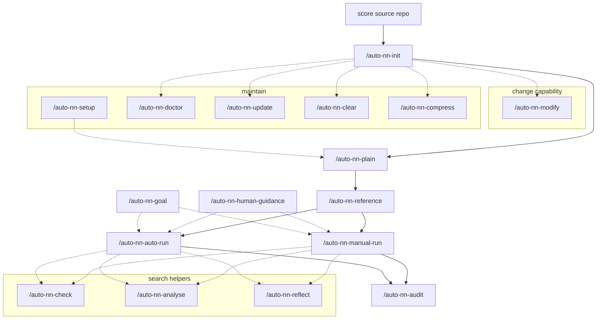

<p align="center">
  <picture>
    <source media="(prefers-color-scheme: dark)" srcset=".github/assets/logo-dark.png">
    
  </picture>
</p>

<p align="center">
  <b>STEER</b> (Steerable and Traceable autonomous Experimentation for Evidence-governed AI Research) is an AI4R (AI for Research) experiment framework for <b>auto-research</b> and <b>autonomous research</b>: connect existing projects from different fields, and let an agent edit code and train <b>under governance</b>.<br>
  You freeze the task, the scorer and the evidence. The agent may change the implementation, not the exam. Install it, then use it in Cursor or Claude Code.
</p>

[English](README.md) · [简体中文](README-zh.md)

[](LICENSE)
[](CHANGELOG.md)
[](template/package/pyproject.toml)
[](#quick-start)

[What it is](#what-it-is) · [Quick start](#quick-start) · [What a connected run looks like](#what-a-connected-run-looks-like) · [How it works](#how-it-works) · [The 17 skills](#the-17-skills) · [Exploration space](#exploration-space) · [Appendix](#appendix)

---

## What it is

Bring in a research project you already have. Each project keeps its own task and scorer; they are not folded into one public leaderboard.
The agent may change training code and run rounds. It may **not** rewrite the task, the official test, or the scoreboard after the fact.

That fence is **governance**: the agent searches; the task, the official test, and the evidence stay yours. Health checks, a target, a human roadmap, and a human stamp after audit belong to the same fence. The paper argues for this layer; this repository implements it — they are not the same artifact.

| Aspect | What |
|---|---|
| How it arrives | Existing training code, a third-party framework, or a data-first tree. |
| Training paradigm | Supervised learning, reinforcement learning, or equation/field-constrained (physics) training. |
| Scenes already run | Image classification, continual learning, tabular modelling, physics simulation, continuous control, language modelling, wireless communications. These are **field examples** — same workflow across topics, not one public exam. How a *project* splits official experiment settings is [Scenarios](#scenarios). The walkthrough still uses image classification. |

<p align="center">
  
</p>

Five steps: score the source repo → onboard so the task and evaluator freeze as a contract → set a naive lower bound and a public comparison → search (autonomous or by hand) → audit, then a human stamps the result. The agent only changes the implementation — it does not hold the rulers. Frozen contract, writable workspace, scoreboard, and skills that keep those roles apart are the governance around search.

| Piece | Role |
|---|---|
| Contract (`contract/`) | You freeze the task, data boundary, main metric, evaluator and time budget. The agent can read this, not edit it. Onboarding also asks **information permissions**: what training may see, and how the official score must be computed. |
| Workspace (`workspace/`) | The only place the agent writes code. |
| Scoreboard (`_runs/`) | Every round keeps its diff, logs and scores. |
| Two comparisons, then an audit | A naive method (lower bound) and a public method (reference). After search, [audit](#audit) the current best; **you** decide whether to keep it. |

This repository is the **template**. Your experiment lives in a **separate project directory**. Scenarios, audit, health check, new machine: [How it works](#how-it-works).

---

## Quick start

### What you need

| Need | Why |
|---|---|
| Linux or macOS | Install and training assume a Unix shell. |
| `git`, `bash`, Python 3.10+ | Clone the template, install skills, run training. |
| [Poetry](https://python-poetry.org/) | Generated projects are Poetry projects. |
| [Cursor](https://cursor.com) or [Claude Code](https://claude.com/product/claude-code) | You type `/auto-nn-init`, `/auto-nn-auto-run`, and so on in the chat. |
| GPU (optional) | To cap usage, put indices in `~/.gpus` (e.g. `0,1`). No file means no cap. |

Clone this template **once** and install the skills. Do not train inside the template clone.

```bash
git clone https://github.com/xieyulai/steer.git
# git clone https://gitee.com/xieyulai/steer.git
cd steer
./install.sh            # --dry-run to preview; --uninstall to remove
```

Skills are **linked** into `~/.cursor/skills/` and `~/.claude/skills/`. Your experiment project does not get a copy of `skills/`.

### Recommended path: bring an existing training repo

Do **not** start from an empty folder and hope the agent invents a paper baseline.
Take a repo that already trains, score it on **this machine**, then connect it.

The walkthrough below uses [kuangliu/pytorch-cifar](https://github.com/kuangliu/pytorch-cifar)
(CIFAR-10) as the **source**. To see a project that is already connected, open
[xieyulai/steer-cifar](https://github.com/xieyulai/steer-cifar). The same order applies to your own code.

#### 1. Score the original repo on this machine

Clone the training repo you want to connect (CIFAR source: [kuangliu/pytorch-cifar](https://github.com/kuangliu/pytorch-cifar)). Follow **that** repo’s README, run the author’s training entry once, and write down the official test score on this machine. Do **not** copy a number from a paper and call it “our score”.

#### 2. Point `/auto-nn-init` at that repo

In Cursor or Claude Code, with the skills installed, run (do not create a folder yourself, and do not train inside this template):

```text
/auto-nn-init <path-to-your-repo>
```

`<path-to-your-repo>` is the original training project (for the CIFAR walkthrough, the clone of [pytorch-cifar](https://github.com/kuangliu/pytorch-cifar) — not steer-cifar). No existing code? Point it at where you want the new project. The original tree stays read-only. The connected project is a **new directory next to it** (the agent will tell you the path). Later steps all happen there, via skills.

The agent asks one question at a time (**27** when connecting an existing repo, **24** from scratch), by theme: alignment → scenarios and data → **information permissions** (what training may touch, how the official score must be computed, any other rules) → training and goals → how scores are kept → run settings. If unsure, see the [appendix](#init-qa); the three information-permission questions are [in this section](#init-qa-info). When migrating, follow the source repo.

#### 3. Put a lower bound and a public comparison on the board

In that new project, in the agent, **in this order**:

| What you want | Skill | What happens |
|---|---|---|
| A naive method that still obeys the frozen task | `/auto-nn-plain` | One easy recipe, scored here. This is the floor. Do not change the contract to make it “naive”. |
| A public comparison | `/auto-nn-reference` | Reproduce a published method **in this project**. Because the source repo exists: the original entry on this machine and the migrated run must **agree** before a literature number is used. If they disagree, fix the migrated recipe — do not paste the paper score. |

Neither of these skills replaces the current best. Each scenario gets at most one of each.

#### 4. Run experiments

| What you want | Skill |
|---|---|
| Target score / how adventurous the search may be | `/auto-nn-goal` |
| Instructions the agent must follow | `/auto-nn-human-guidance` |
| Many rounds unattended | `/auto-nn-auto-run` |
| One round (or a few in parallel) by hand | `/auto-nn-manual-run` |
| Read the scoreboard | `/auto-nn-check` · `/auto-nn-analyse` |
| Think without training | `/auto-nn-reflect` |

#### 5. Finish with an audit

```text
/auto-nn-audit
```

Reproduce the current best, try several seeds, and (if it looks new and reproduction holds) take pieces off to see what actually helped.
Audit runs **do not** go on the scoreboard. The agent will ask you to **keep / park / reject** and will not fill that in for you. Details: [Audit](#audit).

That is the full loop: original score → connect the project → lower bound + public comparison → search → audit.

---

## What a connected run looks like

CIFAR: the **original training repo** is [kuangliu/pytorch-cifar](https://github.com/kuangliu/pytorch-cifar); the **connected example** is [xieyulai/steer-cifar](https://github.com/xieyulai/steer-cifar).

<p align="center">
  
</p>

One ~20-round run from that connected example. Light-blue dots are attempts (some rounds have two, from parallel slots). The dark-blue step line is the running best — it only rises. The black dotted line is the naive lower bound (~0.951); the blue dashed line is the public comparison (~0.9585). The search clears both rulers in the first few rounds, climbs to about 97.7%, then plateaus — later rounds still try, but they do not lift the step line.

---

<a id="how-it-works"></a>

## How it works

You do not need this before the first run. Governance is the fence around search. Four distinctions you actually use: how a project splits its exam papers, how to audit the current best, whether the tree can still run, and new-machine vs template updates.

| You want to know | See |
|---|---|
| How official settings keep separate scores | [Scenarios](#scenarios) |
| Whether to keep the current best | [Audit](#audit) |
| Whether this project can still run | [Health check](#doctor) |
| New machine / new template version | [New machine and template updates](#setup-update) |

<a id="scenarios"></a>

### Scenarios

Inside a connected project, one official experiment setting is a **scenario**: what you measure, and how that run starts. Scores are kept and compared **per scenario** — comparable within a setting, not mixed across settings into one “who is better”.

- **One official protocol:** one row on the list is enough (the CIFAR walkthrough is usually like this).
- **Several protocols in the paper:** one row per setting. Current best, lower bound, and public comparison are tracked separately; target scores can differ too.
- **Searching several at once:** stay on one, or rotate through the list.
- **Add a setting after onboarding:** `/auto-nn-modify`, not a routine sweep. How onboarding asks this: [appendix](#init-qa).

“Scenes already run” above are field examples. Here, scenarios are **how this project splits its own exam papers**.

<a id="audit"></a>

### Audit

Search looks for a better score on the board. An audit is an **off-board** check of the current best (or a run you name). You can run it during search or after; you do not have to wait until the budget is gone. Skill: `/auto-nn-audit`.

- **Reproduce:** train the same recipe again and see if the score still holds.
- **Several seeds:** try a few random seeds, to see if it was one lucky run.
- **Take pieces off:** first decide whether it looks new; only if it is new *and* reproduction holds do we ablate to see which part actually helped. When the target is the public comparison, skip novelty and ablation.
- **Not on the scoreboard.** These runs do not change the current best. The conclusion is an audit card. The agent asks **keep / park / reject** and does not fill that in for you.
- **Not:** a [repo health check](#doctor), and not “what to try next” (`/auto-nn-reflect`).

If there is no lower bound or public comparison yet, the card is informal and will tell you to set those rulers first.

<a id="doctor"></a>

### Health check

An audit asks whether the current best is trustworthy. A health check asks whether **this project can still run**, not whether the score is good (that is `/auto-nn-analyse`). Skill: `/auto-nn-doctor`.

- **What it looks at:** layout, whether the contract and workspace were broken, scoreboard headers, whether training code hard-codes knobs or swallows errors, and whether the template version still matches.
- **Three outcomes:** pass / warning (you may keep training) / fail (fix first). The report starts with one plain-language sentence.
- **Lightweight by default** (static only). Ask for a deep run when you want a short training probe or a “migration complete” check.
- **Report only.** It does not edit code or delete run leftovers (cleaning is `/auto-nn-clear`).
- **What to run next:** old template → `/auto-nn-update`; this machine is missing PyTorch or the driver does not match → `/auto-nn-setup`. See [new machine and template updates](#setup-update).

<a id="setup-update"></a>

### New machine and template updates

Say these in the **already-connected project**, not inside this template (STEER) clone.

| What you ran into | Use |
|---|---|
| New machine, OS reinstall, missing venv, torch does not match this GPU driver | `/auto-nn-setup` |
| STEER shipped fixes and the connected project should catch up | `/auto-nn-update` |
| Layout / contract / scoreboard header looks broken, or you changed code and want to know it still runs | `/auto-nn-doctor` ([health check](#doctor)) |

**`/auto-nn-setup`** fixes **this machine** so it can train: pick a torch build that matches the driver, install deps (slow installs retry on a China mirror), and if you keep a GPU allow-list at home, intersect it with cards that actually exist here. On failure it rolls back the dependency files it just changed. It does not pull template features, and it does not onboard a new project.

**`/auto-nn-update`** copies fixes from **this STEER template (already git-pulled)** into the current project (workspace code and contract body stay). It finishes with a health check and stops on a fail. If the template on this machine is stale, tell the agent to pull it first. Do not start this from the STEER repo root.

**Do not mix them:** cannot train → setup; template changed → update; you only want “is the structure healthy” → doctor (report only). A new topic is still `/auto-nn-init`.

---

## The 17 skills

Solid arrows are the usual order. Dashed arrows mean “use when you need it”, not a required step. The table follows the same stages; details live under [How it works](#how-it-works) or the [appendix](#appendix).



| Stage | Skill | What it is for |
|---|---|---|
| Connect | `/auto-nn-init` | Connect a new project or existing code. The questions: [appendix](#init-qa). |
| Rulers | `/auto-nn-plain` | A naive method that still scores — the lower bound. |
| Rulers | `/auto-nn-reference` | Public comparison; align on this machine when a source repo exists. |
| Search | `/auto-nn-goal` | Target, main metric, and search style. [Appendix: exploration style](#explore-style) · [Appendix: project config](#nn-config) |
| Search | `/auto-nn-human-guidance` | Write the instructions the agent must follow. [Appendix: human instructions](#human-guidance) |
| Search | `/auto-nn-auto-run` | Autonomous multi-round search. |
| Search | `/auto-nn-manual-run` | One round, or a few in parallel, by hand. |
| Search | `/auto-nn-check` | Slice the scoreboard. |
| Search | `/auto-nn-analyse` | Read-only “what happened / are we stuck”. |
| Search | `/auto-nn-reflect` | Think without training. [Appendix: reflect](#reflect) |
| Audit | `/auto-nn-audit` | Reproduce · multi-seed · ablation; you decide. [Audit](#audit) |
| Change | `/auto-nn-modify` | Change what the project is *allowed* to do (metrics, scenarios, model, loss) — not a routine sweep. |
| Maintain | `/auto-nn-setup` | After a new machine / reinstall, make this host able to train. [New machine and template updates](#setup-update) |
| Maintain | `/auto-nn-update` | Copy template fixes into an already-connected project. [New machine and template updates](#setup-update) |
| Maintain | `/auto-nn-doctor` | Can this project still run? Does not look at scores. [Health check](#doctor) |
| Maintain | `/auto-nn-clear` | Clean leftover runs (shows a plan first). |
| Maintain | `/auto-nn-compress` | Shorten a long experience file. |

---

## Exploration space

<p align="center">
  
</p>

The horizontal axis is *which layer* you change (training, model, objective, data). The vertical axis is *how deep* (bottom to top: usual → derived → a different method → claimed as novel). Search usually walks the shallow cells of training and model first, and only occasionally climbs. The dashed line is a literature check: claiming you went deep is not a certificate of novelty. The vertical bar sits outside the grid: changing the exam itself needs a human nod. The style bar is explained in the [exploration-style appendix](#explore-style).

---

## Appendix

You do not need this before the first run. Order follows the experiment: onboard → style and config → your instructions → reflect.

| Block | What |
|---|---|
| [What onboarding asks](#init-qa) | 27 questions when connecting a repo / 24 from scratch; includes information permissions |
| [Exploration style](#explore-style) | Careful / Optimize / Innovate / Aggressive / Explore / Auto |
| [Project config](#nn-config) | Connected-project `nn-config.yaml` (target, metric, scenario), and which skill edits it |
| [Human instructions](#human-guidance) | Fairness rules and staged plan |
| [Reflect](#reflect) | Think without training; how retrieval is configured |

<a id="init-qa"></a>

### What onboarding asks

One question at a time. **27** when connecting an existing repo; **24** from scratch (no “legacy assets” trio). When migrating, follow the source repo.

| Steps (migrate) | Theme | What it covers |
|----------------|------|----------------|
| before | Alignment | Task, data, scoring, how deep code changes may go (not one of the 27) |
| 1–2 | Scenarios and data | Official experiment settings; train / val / final-test split |
| 3–5 | **Information permissions** | What training may touch; how the official score must be computed; any other rules |
| 6–7 | Scenarios and data (continued) | Where loading and augmentation live; which data snapshot to lock |
| 8–10 | Legacy assets | Old scoreboards, notes, hard rules from old docs (**migrate only**) |
| 11–12 | Training | What in the objective may move; how the loop runs |
| 13 | Main metric | Main and extra scores |
| 14–15 | Campaign | What this campaign is for; what main-score value stops it |
| 16–23 | Scoring and the scoreboard | Columns, during/after training, what counts as better |
| 24–27 | Run settings | Wall-clock, GPUs, two rulers, seed |
| end | Confirm the spec | Locks the spec; **not** “onboarding done” |

#### Alignment

| Migrate | New | What it asks | What it decides | If unsure |
|--------|-----|--------------|-----------------|-----------|
| before | before | Is this summary of the project right? | Task, data, scoring, how deep code changes may go | Continue if yes; correct the bullets if not. Don’t skip. |

#### Scenarios and data

| Migrate | New | What it asks | What it decides | If unsure |
|--------|-----|--------------|-----------------|-----------|
| 1 | 1 | Which official experiment settings? | How many scenarios scores are kept under, and each start config | List “what we measure + default run”. One setting per official protocol. Follow the source when migrating. |
| 2 | 2 | How are train / val / final-test split? | Which split is the official score, and whether training may see it | Typical: train on train, val during training, test only at the end. Follow the source when migrating. |

<a id="init-qa-info"></a>

#### Information permissions

Answers go into the contract; training is checked against them.

| Migrate | New | What it asks | What it decides | If unsure |
|--------|-----|--------------|-----------------|-----------|
| 3 | 3 | What may training touch? | Which data training may use vs open only at scoring | Training may use only what training is allowed to use; score-only material opens at scoring. Nothing is score-only → choose none. Training that never reads data files is the third option. Follow the source when migrating. |
| 4 | 4 | How must the official score be computed? | The only allowed scoring path | Usually: the model sees the input and produces the score. Restricted path if the official score must go through a prescribed procedure and no other route counts. Locked eval-state if scoring must happen in a specified state. Follow the source when migrating. |
| 5 | 5 | Any other information rules? | Anything besides the two questions above | Choose none if none. Otherwise list them. |

#### Scenarios and data (continued)

| Migrate | New | What it asks | What it decides | If unsure |
|--------|-----|--------------|-----------------|-----------|
| 6 | 6 | Where do loading and augmentation live? | Which layer reads data and augments | Follow the agent’s read of the code. Keep augmentation in editable implementation, not the frozen contract. |
| 7 | 7 | Which data snapshot for reproduction? | Same data on another machine | Record the data root or version. If there is no version, the directory you use now. |

#### Legacy assets (migrate only)

From scratch, these three steps are omitted; later step numbers are 3 lower.

| Migrate | New | What it asks | What it decides | If unsure |
|--------|-----|--------------|-----------------|-----------|
| 8 | — | Bring old scoreboards and run dirs? | Whether the new project keeps old numbers | Usually start empty. Keep them only if you still need to compare against old scores. |
| 9 | — | Bring old notes? | Keep / rewrite / drop experience notes | Starting from scratch, you can rewrite. Keep excerpts if they still help. |
| 10 | — | Keep hard rules from old docs? | e.g. “must use this optimizer” | Keep if still binding; drop if it was only a habit. |

#### Training

| Migrate | New | What it asks | What it decides | If unsure |
|--------|-----|--------------|-----------------|-----------|
| 11 | 8 | What in the training objective may move? | **Not** “which loss now”, but the floor for later auto-edits | Follow must-keep / may-swap / may-add / knobs-only. Set the floor from the task. |
| 12 | 9 | How does the training loop run? | Loops and when scoring happens | Follow the agent’s sketch of the code. Follow the source when migrating. |

#### Main metric

| Migrate | New | What it asks | What it decides | If unsure |
|--------|-----|--------------|-----------------|-----------|
| 13 | 10 | Main and extra scores? | Which number ranks runs | The main score is the number used to rank runs; extras are secondary. Follow the source when migrating. |

#### Campaign

| Migrate | New | What it asks | What it decides | If unsure |
|--------|-----|--------------|-----------------|-----------|
| 14 | 11 | What is this campaign for? | Push the score, try new methods, or explore | **Default: raise the main score first.** Go deeper if you want new methods; explore if you don’t want a stop-line yet. |
| 15 | 12 | What main-score value stops the campaign? | Final target, not “is this round an improvement” | **Default: leave unset.** Explore mode only asks a floor, not a main target. |

#### Scoring and the scoreboard

| Migrate | New | What it asks | What it decides | If unsure |
|--------|-----|--------------|-----------------|-----------|
| 16 | 13 | Which scores are main table columns? | Main vs notes | Main score in the main columns. Follow the suggestion. |
| 17 | 14 | Official score **after** training? | Must match “how the official score is computed” | One official pass at the end, through the contract’s scoring path. Follow the source when migrating. |
| 18 | 15 | Score **during** training? | Every epoch / never / sparse | Score a process metric each loop if useful; sparse if training is very slow. Follow the source when migrating. |
| 19 | 16 | Which scoreboard columns? | Header blocks; keep the baseline-role column | Follow the suggestion. Don’t add empty columns for looks. |
| 20 | 17 | What may change each round, how to compare scenarios? | Search rules, not “whether to search” | **One change per round; best scores compared per scenario.** Don’t change architecture and LR together. |
| 21 | 18 | Which hyperparameters to log? | So you can tell which settings produced a row | LR, batch size, seed, etc. Tick the suggestion. |
| 22 | 19 | Save best or last weights? | Can you replay that run | Usually the best validation checkpoint. Last-only if disk is tight. |
| 23 | 20 | How much better than history to keep? | Separate from the campaign stop-line | Too strict and later rounds never keep. If unsure, use the smallest lift that still means “this run is better”; follow the agent’s suggestion. |

#### Run settings

| Migrate | New | What it asks | What it decides | If unsure |
|--------|-----|--------------|-----------------|-----------|
| 24 | 21 | Max wall-clock per training? | Timeout so jobs don’t hang | Seconds for your machine. Short to smoke; longer for search. 0 = unlimited (use sparingly). |
| 25 | 22 | Which GPUs, how many parallel jobs? | Project GPU list and parallelism | To cap usage: put allowed indices in `~/.gpus`, then list the intersection here. No file → no cap; all local cards or empty. Parallel jobs ≤ listed GPUs. |
| 26 | 23 | Set the two rulers first? | Naive lower bound and public reference | **Both recommended.** If no public method, say so; the agent can pick from later scores. |
| 27 | 24 | Random seed? | Reproducibility | **42** is fine. Multi-seed robustness is a later question. |

#### Confirm the spec

| Migrate | New | What it asks | What it decides | If unsure |
|--------|-----|--------------|-----------------|-----------|
| end | end | Confirm the summary | Locks the spec; **not** “onboarding done” | Check the summary. After you confirm, the agent may edit code. Done = a short training run also passes. |

<a id="explore-style"></a>

### Exploration style

Which style you pick sets how deep this round may go, whether papers are retrieved, and whether hitting the target stops the batch. Day to day, tell **`/auto-nn-goal`** “switch to optimize / innovate / explore”. You do not edit the file by hand. Retrieval depth is in the [reflect appendix](#reflect).

| Style | What it does | Stop at target? | Retrieval |
|------|----------------|------------------|-----------|
| Careful | Follow the recipe; start from training knobs; keep only a clear gain | Yes | Almost no papers |
| Optimize (default) | Push the main score; training and model may move | Yes | Light docs and common libraries |
| Innovate | Deeper methods; public implementations when stuck | Yes | Papers and public code |
| Aggressive | Widest search, including the data layer | Yes | Deeper; may fetch full text |
| Explore | Map the method space; do not let the score stop the batch | **No** | Same as innovate |
| Auto | Start at optimize; after 5 stalled rounds, promote to innovate, then aggressive; no demotion | Follows the current style | Follows the current style |

Auto’s ladder is **optimize → innovate → aggressive** (it does not promote into explore). To stop auto-promotion, switch back to an explicit style.

<a id="nn-config"></a>

### Project config (`nn-config.yaml`)

A connected project has **`nn-config.yaml`** at its root. After onboarding it **must** contain: a target score, which main metric to watch, and which scenario is the default. Once a style is chosen, keep-threshold, reflect cadence and paper depth are filled in from that style; you do not turn them on one by one.

Change target and style with **`/auto-nn-goal`**, not by hand. Below is [steer-cifar](https://github.com/xieyulai/steer-cifar) after it was connected (those numbers and scenario names are that project’s; yours will differ).

```yaml
profile: supervised
gpus: [0, 1]                 # project GPU list; fill for your machine. Training also reads ~/.gpus
max_parallel: 2
device: auto
time_budget: 7200          # max seconds per training
seed: 42
deterministic: true
checkpoint: best
exploration_mode: innovate # exploration style; see previous appendix
early_stop:
  patience: 0
goal:
  target: 0.99             # main-score value that stops the batch (must be a number)
  metric: val_accuracy      # which main metric; must be on the contract list
  op: '>='                 # higher is better; use '<=' if lower is better
  policy: focus            # stop on the default scenario below
agent:
  scenario_default: cifar10_autonomous   # which official setting to watch; empty fails the health check
  # scenario_active: cifar10_autonomous  # list when several settings are in play
```

The contract still owns the metric’s direction (here: validation accuracy, higher is better). When there are several official settings, scores stay separate per scenario; the yaml only says which one is the default focus.

**Change it through skills, not as a hand-edited config.**

| You want | Skill | Don’t |
|--------|------|------|
| Exploration style, target score, which main metric | `/auto-nn-goal` | Don’t hand-write `exploration_mode` / `goal` |
| Which scenario is the default | Asked at onboarding | Don’t mix scores from two settings |
| Hard instructions and a staged plan for the agent | `/auto-nn-human-guidance` | Don’t put them in this yaml |
| What metrics / scenarios / model / loss **may** do | `/auto-nn-modify` | That is the contract, not this file |
| Wall-clock, seed, GPU list | Asked at onboarding | Don’t change them mid-run; cap occupancy with `~/.gpus` |

<a id="human-guidance"></a>

### Human instructions (`HUMAN_GUIDANCE.md`)

These are your hard instructions to the agent. They outrank the next-round suggestion from reflect. Training rounds and autonomous batches **must not** edit this file; only **`/auto-nn-human-guidance`** may (you speak the intent; the skill writes, validates, and commits). If a batch is running, stop it first, then change, then restart.

Two blocks, side by side:

| Block | Put here | Don’t put here |
|------|----------|----------------|
| Fairness rules | Comparison rules and bans that hold across stages (e.g. official runs must train a fixed number of epochs) | Stage progress, next step, training diary |
| Roadmap | Stages: what it is, the goal, done-when; optional one-line next step | Fairness rules inside a stage |

No stages = empty roadmap = the agent proceeds on its own. The skill writes only what you said; it will not pad with template defaults. Do not put “on/off reflect” here.

Clearing the roadmap (back to full autonomy) uses the same skill: a plan first, then you confirm. The scoreboard and current best stay.

<a id="reflect"></a>

### Reflect (think, do not train)

In chat, type `/auto-nn-reflect`. That round **does not train and does not edit training code**. Autonomous batches also run it when it is due: several rounds with no gain, a failed training, a discarded round, every few rounds, or when you force it. **It is not every round.** Turning off automatic reflect still leaves the hand-run. Your written instructions outrank the reflect suggestion.

#### What it does

1. **Read this project**: the scoreboard, the experience notes, which layer this round changed and how deep it went.
2. **Retrieve** (skippable): papers, official docs, and public code, according to that layer/depth and the current search style. Cite only what the script found; **do not invent paper URLs**. A missing network or key skips that source; reflect continues.
3. **One next-round suggestion** (at most one at a time). The next training round must answer: adopt, defer, or conflict with your instructions.

#### How to configure retrieval

The usual knob is search style (`/auto-nn-goal`). You do not turn sources on one by one:

| Style | Retrieval |
|------|-----------|
| Careful | Almost no paper search |
| Optimize (default) | Light docs and common libraries; papers stay shallow |
| Innovate / explore | Papers, plus whether a public implementation exists |
| Aggressive | Deeper; may fetch full text |

A new best with no stall skips retrieval by default. To search every time, set innovate or aggressive. Do not put “on/off reflect” in the instructions you write for the agent.

Keys go in `~/.env` (do not commit):

| Source | Key |
|------|-----|
| arXiv, OpenAlex | None; needs network |
| Google Scholar | `SERPER_API_KEY` (or `SERPER_KEY`) |
| GitHub public implementations | Works without a token, low rate; `GITHUB_TOKEN` raises the limit |

**Queries**: short and specific — this project’s method name and task. Generic tokens such as `cnn`, `model`, `loss` are dropped. Do not mix the two tracks: “is there a public implementation” is code-repo search; “is this a built-in API” is documentation.

Smoke-test from the project root: `python3 scripts/external_tool.py arxiv -q "method-name task"`.

---

## Other documents

| Document | Content |
|---|---|
| [`docs/init-conversation-guide.md`](docs/init-conversation-guide.md) | Onboarding progress bar and good/bad examples |
| [`docs/skill-glossary.md`](docs/skill-glossary.md) | Names used in the skills |
| [`template/package/PROTOCOL.md`](template/package/PROTOCOL.md) | Rules a connected project runs under |
| [`docs/examples/adapter-mammoth/`](docs/examples/adapter-mammoth/) | Binding an external training framework (Mammoth) |
| [kuangliu/pytorch-cifar](https://github.com/kuangliu/pytorch-cifar) | Original CIFAR-10 training repo (source you score, then point `/auto-nn-init` at) |
| [xieyulai/steer-cifar](https://github.com/xieyulai/steer-cifar) | Connected CIFAR-10 example (after STEER; separate GitHub repo) |

---

## Development

### Layout of this repository

```text
steer/
├── template/package/   ← copied into every experiment project
├── skills/             ← the 17 skills (installed by ./install.sh)
├── install.sh
├── tests/
└── docs/               ← whitepaper and skill reference
```

### Tests

```bash
python3 -m pip install pytest pyyaml numpy                   # training tests also need torch, torchvision
python3 -m pytest tests -q
python3 -m pytest template/package/scripts/tests -q
bash template/package/scripts/check_package_docs_contract.sh
bash template/package/scripts/check_skill_contract.sh --quiet
```

Maintainers: [`README-maintainer.md`](README-maintainer.md), [`CLAUDE.md`](CLAUDE.md), [`CHANGELOG.md`](CHANGELOG.md).
Releases: [SemVer](https://semver.org/), `/bump-version`.

## Contributing

[`CONTRIBUTING.md`](CONTRIBUTING.md). Issues: [GitHub](https://github.com/xieyulai/steer/issues) · [Gitee](https://gitee.com/xieyulai/steer/issues).

## License

Apache License 2.0 — [`LICENSE`](LICENSE), [`NOTICE`](NOTICE).
