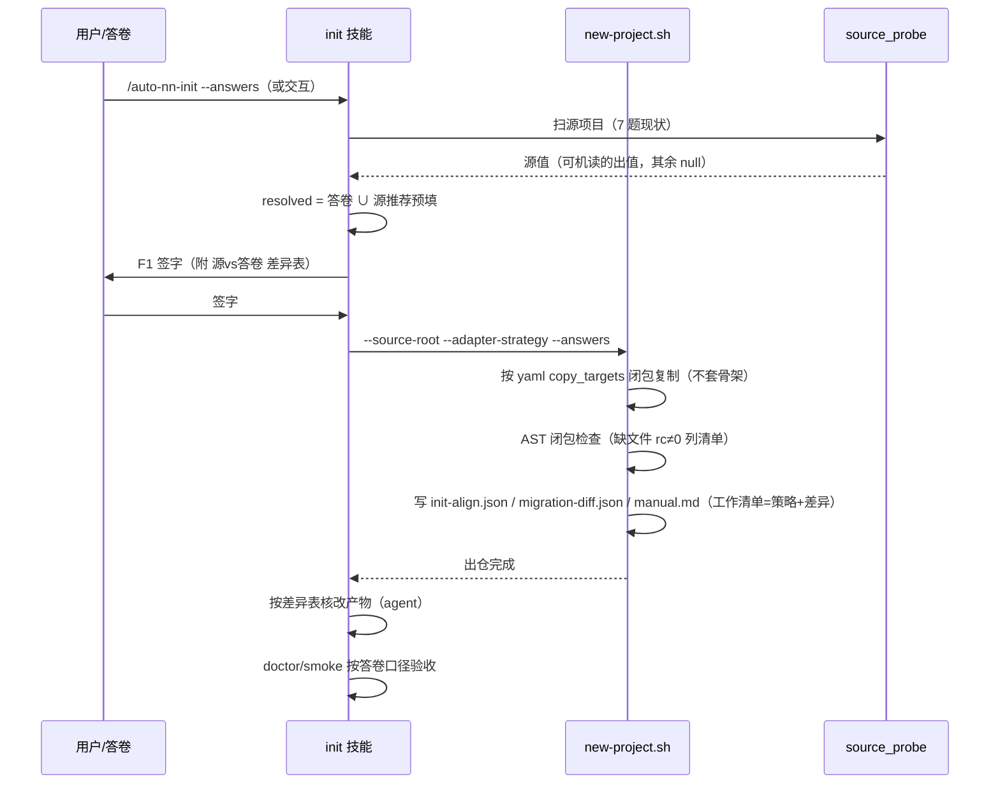

# spec：migrate 修复（fork-and-own 语义落地）

- 日期：2026-09-24
- 状态：草案（待评审）
- 影响仓：steer（本仓）
- 关联：`AUTO_RESEARCH/auto-nn-factory/docs/20260924_2110_记录_STEER-init机制与借码场景比对.md`（问题调研与实测证据，本文不重复展开）
- 实测产物（可复跑）：`/tmp/migrate-real-test/{default,no-skel,port}`、`/tmp/migrate-port-src`

## 1. 问题清单（全部 2026-09-24 实测复核）

| # | 问题 | 证据落点 | 严重度 |
|---|---|---|---|
| P1 | 骨架反杀：先复制源 contract 五件 + workspace/__init__.py，随后 skeleton 无条件覆盖；日志宣称「已从源项目复制」但产物是演示骨架。真实仓（8 波束 share 仓）6 件复制 5 件被盖，仅 train.py 幸存，产物 `import train` 即 `ImportError: get_training_mech` | `new-project.sh:339-377` | 硬 bug |
| P2 | adapter 死信：`.auto-nn/init-adapter-pending.txt` 写入后无任何消费方（init 技能三文档 grep 零命中），keep_all/hybrid/rewrite 三选一永不发生 | `new-project.sh:242-260` | 硬 bug |
| P3 | 复制白名单太窄：固定 6 件。真实仓 `workspace/legacy_transformer.py` 不在名单 → `--skeleton none` 也 import 炸；`experiment.py`/`contract/scaling_laws.py`/`scenario_capacity.py` 留模板演示版（哈希≠源）→ 静默内容错配 | `new-project.sh:204-229` | 硬 bug |
| P4 | port_to_contract 假复制：复制条件 `[[ ! -f "$DEST/$f" ]]` 恒假（模板先装了 train.py），日志宣称复制、实际产物是模板演示版 | `new-project.sh:231-239` | 硬 bug |
| P5 | 两套真源：migrate.yaml 自注「patterns 仅定义不接入」，pattern 分流是 shell 内联 if；yaml 的 port_targets/wrapper_contract/protected_paths 无代码消费 | `scenarios/migrate.yaml:8-29` | 设计混乱 |
| P6 | yaml 语义与 shell 行为矛盾：yaml 说 workspace_wrapper 是「代码留源仓、无状态翻译」，shell 干的是「整份复制进来」 | 同上 | 设计混乱 |
| P7 | 源对齐不对账：交互模式措辞倾向源（「改回确认」）；confirm_only 直接短路 `confirm_required`，注释称「差异并入签字表」但无代码读源项目生成差异——答卷「赢」是靠不对账赢的 | `lib/init_answers.py:577-586` | 流程缺失 |
| P8 | 入口焊死：有 `--source-root` 即 entry=A 强制 27 步交互，headless confirm_only 无法走 migrate；A 27 / B 24 题卷错位，B 卷答卷校验直接报缺题 | `new-project.sh:387-388`；registry `entries/step` | 流程限制 |

## 2. 目标 / 非目标

**目标**

1. migrate（源有 contract）出仓产物 = 源代码完整存活、内部 import 闭包完整、日志与产物一致。
2. 优先级语义显式化并落地：**显式答卷 > 源项目现状 > 模板演示**；差异对账可见、且物理落到复制产物上。
3. headless（confirm_only + 答卷）可完整走通 migrate，全程无 AskUserQuestion。
4. pattern 分流、复制名单、指导文案只有一份真源（migrate.yaml），shell 只消费不定义。

**非目标**

- 不实现「代码留源仓、运行时调源 API」的真 wrapper 模式（protected_paths 运行时机制）——yaml 中删除该描述，待真实需求出现另立 spec。
- 不改 build / update 路径的任何行为。
- 不做跨仓依赖的深度静态分析（只做 AST 级内部 import 闭包检查）。
- 不承担 auto-nn-factory 1.8「模板实例化」需求本身（该需求走 factory 侧方案甲；修好后的 migrate 是否被 factory 改用，另议）。

## 3. 语义定调（核心决策）

migrate 统一为 **fork-and-own**：源资产复制进新仓、新仓拥有、后续演进只在本仓。二级 pattern 简化为：

| pattern | 触发 | 行为 |
|---|---|---|
| **full_copy**（原 workspace_wrapper 更名） | 源有 `contract/` | 按闭包名单复制源代码，不套演示骨架，口径以「源 + 答卷差异」为准 |
| **port_to_contract**（保留） | 源无 `contract/` | 老资产整份拷进 `references/legacy/` 作只读参考，agent 按 port_targets 手抄拆解；根上保持模板结构 |

更名理由：workspace_wrapper 名字与其真实行为（复制）相反，是 P6 的根源。

## 4. 优先级语义（答卷 vs 源项目）

```
显式答卷（用户声明的新口径） > 源项目现状（默认值 + 资产供体） > 模板/骨架演示
```

三条规则：

1. **「推荐跟源」是预填推荐，不是否决权。** 7 道 source_aligned 题的推荐值 = 探针扫出的源现状；用户显式改值必须赢。交互弹卡措辞从「清单说 X 源是 Y，改回确认」反转为「推荐=源值 X，你填了 Y，确认按 Y 立项」。
2. **答卷赢必须赢在代码上。** 出仓复制源代码后，按「源 vs 答卷差异表」核改产物（contract 的 prepare_data/test/metrics 落点）。差异表在 F1 签字前生成、签字后执行、验收时复核——现在两个模式都没有这一步，是本次修复新增的核心语义。
3. **没被问到的维度，源代码即事实。** 答卷只覆盖注册表里的题；题外维度以复制进来的源码为准，不做推断。

## 5. 详细设计

### D1 骨架不反杀（修 P1）

`new-project.sh` migrate 分支：

- full_copy 路径：**不再设置 `_SKEL_APPLY`**（等价内置 skeleton=none）。`--skeleton` 对该路径废弃：显式传非 none 值时打警告并忽略，不再默默覆盖源代码。
- `_apply_contract_skeleton` 中的版本戳写入（`nn_state_write version` / `write_once init-template-version` / README Template version 行）**拆出**为 `_write_template_version`，骨架跳过时仍执行——模板溯源不随骨架一起丢。
- port_to_contract 路径：维持套骨架现状（该路径本就要模板结构）。
- build 路径：不动。

### D2 复制闭包 + import 检查（修 P3）

full_copy 默认复制集（定义在 migrate.yaml，见 D6）：

- `contract/*.py` 全部（含 `__init__.py`，排除 `__pycache__`）
- `workspace/` 整目录（排除 `__pycache__`）
- 根级 `train.py`、`experiment.py`（存在则）
- **仍禁**：`data/`、`_runs/`、`saved/`、`references/`、`.git`、虚拟环境——守住「选择性移植、禁 cp -r 整包」立场

复制后新增 **AST 闭包检查** `_check_copy_closure`（python 实现，无需装依赖）：扫描已复制 `.py` 的内部 import（`contract.*` / `workspace.*` / `experiment` / `lib.*` / 根级模块），逐个验证目标文件存在于产物中。缺失则 rc≠0 并列出缺什么、建议补进 `copy_targets` 或手抄。真实仓的 `legacy_transformer` 缺失在出仓当秒即被拦下，不用等 runtime。

### D3 adapter 策略进问卷（修 P2）

- 题库新增一题：slug `M0-adapter-strategy`，key `adapter_strategy`，entries `[A]`，仅 pattern=full_copy 时计步；选项 keep_all / hybrid（推荐）/ rewrite，锁文本写明各自含义。
- 语义改为「改多少」分级（配合 D4 的差异落地）：
  - **keep_all**：整套照抄不改（源口径即新仓口径，答卷须与源一致，否则 F1 拦）
  - **hybrid**：保留 metrics/runtime，重写 prepare_data/test——重写目标恰是 7 道口径题的落点
  - **rewrite**：源仅作参考，按 profile 重写全套
- `new-project.sh` 加 `--adapter-strategy <k>` 消费 resolved 值，写入 init-align.json 与 manual.md 工作清单（keep 的文件标「保留」，重写的标「须按答卷核改」）。**shell 复制行为不随策略变**（一律全复制），策略只影响 agent 工作清单——shell 保持哑的，语义在指导层。
- 删除 `_adapter_ask_strategy` 与 `.auto-nn/init-adapter-pending.txt`。

### D4 源对齐对账（修 P7，新增语义）

数据流：

1. **源现状提取**（新 `scripts/lib/source_probe.py`）：对 7 道 source_aligned 题做静态提取。v1 只机读可静态确定的（如：数据划分的 seed/比例 ← `contract/prepare_data.py` 常量；主辅指标键 ← `contract/metrics.py` 的 `METRIC_KEYS`/`AUXILIARY_KEYS`）；提不出的输出 `null` 并标「需人工核对」。**不假装全能。**
2. **差异表生成**（`lib/init_answers.py`）：`confirm_required` 不再被 confirm_only 短路；改为——交互模式照旧弹卡（措辞按 §4 反转）；confirm_only 模式生成机器可读差异表，替代弹卡。
3. **差异表消费**：F1 签字表附「源 vs 答卷」逐条对照（slug、源值、答卷值、落点文件）；签字后出仓时写 `.auto-nn/migration-diff.json`，manual.md 工作清单把差异条目转成「须核改 <文件>」任务。
4. **落地验收**：doctor 增加一项——对 migration-diff.json 里每条差异，检查对应落点文件是否含答卷口径（v1 可为 agent 自查 + 抽检，不强求全自动）。

### D5 入口解耦 + 卷互通（修 P8）

- entry 判定从「有 source-root 即 A 交互」改为由**喂卷方式**决定：答卷全覆盖 → confirm_only（headless 合法，含 migrate）；无答卷 → 交互（人类用户不变）。
- A-only 题（旧资产清理段）在 confirm_only 下允许答卷作答；交互专属动作（资产盘点弹卡、`close --user` 矛盾核销、migration-summary 签字）在 confirm_only 下降级为「读答卷 + 生成文件 + warnings」。
- 卷互通：题库本就同 slug 异步号（registry `step: {A: n, B: m}`），B 卷答卷按 slug 直接映射 A 卷；A-only 题缺答时明确报「须补 N 题」而非整表作废。

### D6 一套真源（修 P5/P6）

- migrate.yaml 重写为真实语义：`patterns.full_copy.copy_targets`（D2 名单）、`patterns.port_to_contract.legacy_dir: references/legacy/`、`port_targets`（手抄指导，保留）；删除 wrapper_contract/protected_paths 的未实现描述。
- 新增小 helper（扩展 `new_project_scenarios.py` 或新建 `new_project_patterns.py`）：new-project.sh 的 pattern 分流、复制名单、参考目录全部从 yaml 读；shell 内联 if 删除。
- 单测：yaml 改动后 shell 行为随之变（防「改一边漏一边」回归）。

### D7 port_to_contract 假复制修复（修 P4）

- 删除恒假的 `_copy_migration_essentials` 覆盖逻辑。
- 改为：源根 `*.py` 与必要脚本拷进 `references/legacy/`（只读参考区，不碰模板结构），日志如实说「已存参考副本到 references/legacy/」。
- 手抄拆解仍由 agent 按 port_targets 指导执行（该路径的本意）。

## 6. 修正后时序



## 7. 验收标准（Given/When/Then）

用例 A：真实仓 full_copy（源 = `NS3_API/auto-nn-bm-case1-setb-simple-v2-share-20260921`）

- A1. 默认参数 migrate 出仓 → 复制集内每个文件 sha256 与源一致；无「已应用骨架」日志；版本戳仍写入。
- A2. AST 闭包检查 → 通过（legacy_transformer 等已被闭包名单覆盖）。
- A3. 装 poetry 依赖后 `PYTHONPATH=scripts python -c "import train"` → exit 0。
- A4. 答卷改 D2（数据划分）与源不同 → `.auto-nn/migration-diff.json` 含该条；manual.md 工作清单含「核改 contract/prepare_data.py」。
- A5. `--skeleton supervised` → 打警告忽略，产物哈希同 A1。
- A6. confirm_only 全程无 AskUserQuestion，exit 0。

用例 B：无 contract 老仓 port_to_contract（源 = `/tmp/migrate-port-src` 类）

- B1. 出仓后 `references/legacy/train.py` 内容 = 源 train.py；根 train.py = 模板版；日志与产物一致（不再假称复制到根）。

用例 C：回归

- C1. build 路径（无 source-root）行为与修复前逐字节一致（骨架照套、演示 contract 照装）。
- C2. update 路径同上。
- C3. yaml 单测：copy_targets 增删一个文件 → 出仓复制集随之增删。

## 8. 兼容性影响

- 现有 migrate 用户行为变化：full_copy 默认产物从「演示骨架+train.py」变为「源代码全集」——这正是修复目的；依赖旧错误行为的（若有）须显式 `--skeleton`（已废弃并警告）。（推测：migrate+源有 contract 的存量用户极少，昨今两次实测未发现幸存路径。）
- `.auto-nn/init-adapter-pending.txt` 删除：无消费方，无兼容负担。
- confirm_only 差异表为新增产物，旧答卷文件格式不变。
- A 卷交互流程保留（人类用户不变），仅措辞反转。

## 9. 开放问题

1. source_probe v1 的机读覆盖度：7 题里几题可静态提取？（实现时定边界，宁缺毋假）
2. A-only 旧资产清理题的 confirm_only 默认值从哪来（卷里必填 vs 给保守默认+warning）。
3. keep_all 策略下答卷与源冲突：F1 拦截还是自动改答卷？（倾向拦截，显式优先）
4. doctor 的差异落地检查 v1 做到什么强度（agent 自查清单 vs 自动断言）。
5. 本仓直接实施 or 走维护流程评审——steer 即本所维护仓，待定。

## 10. 缩略语

- **STEER**：本所 auto-nn 实验框架的模板/技能维护仓（本仓）
- **migrate / build / update**：init 立项的三种 workflow——迁入老仓 / 全新立项 / 同仓二次立项
- **full_copy / port_to_contract**：migrate 按「源有无 contract/」的二级分流（full_copy 为原 workspace_wrapper 更名）
- **fork-and-own**：源代码复制进新仓、新仓拥有并继续演进的语义
- **contract / workspace**：auto-nn 项目中承载口径（数据划分、指标、终评）的不可变目录 / agent 可改写目录
- **skeleton**：按 profile（supervised/rl/physical）的范式演示骨架
- **source_aligned（源对齐题）**：migrate 时推荐值须跟源项目的 7 道口径题（D2/I1/I2/T2/E1/E3/E4）
- **confirm_only**：答卷覆盖全部计步题时的「只签字不逐题弹卡」模式
- **F1**：init 问答末尾的口径汇总签字步骤
- **AST**：Abstract Syntax Tree，抽象语法树（此处指用 python 静态解析 import，不执行代码）
- **答卷 / 答题卡**：机器可读的完整 init 答案清单

---

## 说人话

migrate 这个功能号称「把老项目搬进新家」，实际上一进门就把搬来的家具扔了换成样板间（P1），搬还没搬全、缺胳膊少腿（P3），有一张「选家具风格」的问卷塞在门缝里从来没人看（P2），搬家日志还瞎写「已搬入」（P4）。修法就四件事：**真搬**（按依赖关系搬全套，搬完当场点名查漏）、**不换样板间**（新家就是老项目的样子，想要演示样板请走 build）、**问卷说了算但要兑现**（你想改的地方列成清单，逐条真的改进搬来的代码里，最后按你的新要求验收）、**机器也能搬家**（不强制人工问答）。改完拿那个 8 波束真项目一跑：文件哈希对得上、import 不炸、改的口径落在代码里——就算修好了。
