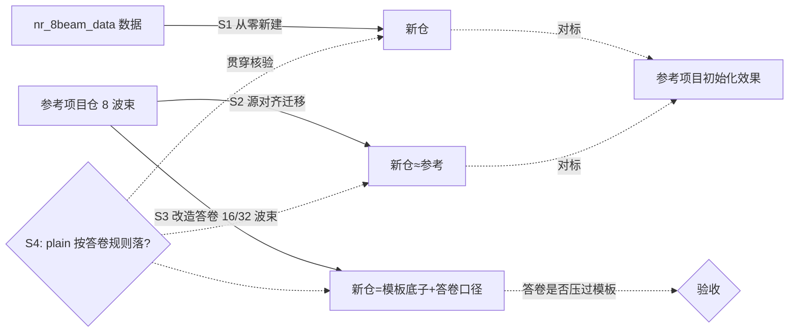

# 四场景初始化核验方案（从数据新建 / 模板迁移 / 答卷优先改造 / plain 落位）

日期：2026-09-25　状态：待执行（本文只整理问题与验收标准，未开工）

## 0. 素材

| 素材 | 出处 | 说明 |
|---|---|---|
| 参考项目 | [wiki：BM-Case1 实验项目（STEER 交付包）](https://zcnvuklbl9sl.feishu.cn/wiki/KatywVxgJiKUbUkmquXcRYphnEg) | 6 Set-B × 5 方案台账成绩、解读与限制（单折单种子，未跑正式测试集）。本地快照：`NS3_API/auto-nn-bm-case1-setb-simple-v2-share-20260921/`（即该交付包，用户 2026-09-25 确认） |
| 数据集 | [wiki：nr_8beam_data 说明](https://zcnvuklbl9sl.feishu.cn/wiki/KNaGweQQxiqJFAkKwTgcJdATnSh) | 生成条件、CSV 格式、已确认数据规律。与仓内答卷口径 `uereports_v1` 为同一批数据（用户 2026-09-25 确认） |

既有事实（今天已实证，写死不猜）：
- 同仓连续两次 migrate 结果如实可复现（核验①）。
- 答卷改 16 波束 vs 源 8 波束：migrate 成功不报错，**差异不被机器捕获**（探针抓不到 `BEAM_COLUMNS`），仅在 `references/manual/abcde-manual.md` 的「适配与差异工作清单」里把 `contract/prepare_data.py` 列为须核改落点（核验②，产物 `/tmp/migrate-verify-b16`）。
- confirm_only 答卷必须自带「适配策略」（M0）题，`--adapter-strategy` 旗标不能替代覆盖检查。

## 1. 四场景总览

| # | 名称 | 一句话 | 输入 | 判定核心 |
|---|---|---|---|---|
| S1 | 从数据新建 | 光有数据 + full 答卷，从零立项 | nr_8beam_data + full 答卷 | 初始化效果 ≈ 参考项目 |
| S2 | 模板迁移 | 拿参考项目当模板迁一份 | 参考仓 + 源对齐 full 答卷 | 初始化效果 = 参考项目 |
| S3 | 答卷优先改造 | 答卷要求与模板不同（8→16/32 波束等），看谁说了算 | 参考仓 + 改造版 full 答卷 | 基于模板修改成立、口径按答卷 |
| S4 | plain 落位 | 用户指定的 plain（非AI起步尺子）怎么体现：答卷写 vs 模板参考 | 三场景通用核验维度 | plain 只按答卷规则落，模板实测值不迁移 |

三场景建仓路径递进（S4 为贯穿核验维度，不是第四条建仓路径）：

## 2. 「初始化效果类似」怎么判（建议口径，待拍板）

初始化阶段不训练、不出成绩，可比的是**立项产物**。建议五条全过才算「类似/一致」：

1. **门禁全过**：nn-doctor 无 FAIL；verify/init 验收单通过；
2. **口径落盘一致**：`.auto-nn/init-answers.resolved.json`、info_perm、manual 的 lock 与答卷逐条一致；
3. **台账就绪**：`_runs/results.tsv` 表头与 contract 指标列一致（空表可）；
4. **起步资产可跑**：起步尺子按答卷生成（如规则尺：被测波束子集 argmax）、训练骨架 preflight 空跑通过；
5. **可复现**：同一输入连跑两次，产物一致（S2 已在核验①验证过 migrate 这条性质，S1/S3 需同样验证）。

## 3. 各场景明细

### S1 从数据新建（entry A，full 答卷）

- **目的**：验证不依赖任何旧仓，仅凭数据 + full 答卷能否立项出与参考项目同水准的初始化（口径完整、资产可跑）。
- **输入**：`nr_8beam_data` + 全新 full 答卷（口径抄参考项目：6 Set-B 场景、80UE 划分、masked 8 维、test_top1 主指标等）。
- **操作**：`new-project.sh <dest> <name> --workflow build --answers <full答卷>`（headless）。
- **验收**：第 2 节五条全过；与参考仓逐项对比口径文件（场景清单/划分/主辅指标/许用材料）应实质一致。
- **已知风险**：headless 假完成坑——须 `env -u ANTHROPIC_BASE_URL -u CLAUDE_CODE_PROVIDER_MANAGED_BY_HOST` 或 tmux；答卷缺 M0 适配策略题会被门禁拦。

### S2 模板迁移（源对齐答卷）

- **目的**：验证以参考仓为模板 migrate，产物与参考项目初始化效果**一致**（保真）。
- **输入**：参考仓 + 源对齐 full 答卷（`/tmp/bm_case1_answers_full.yaml` 已有，含 M0=hybrid 需补——见风险）。
- **操作**：`new-project.sh <dest> <name> --workflow migrate --source-root <参考仓> --answers <答卷> --adapter-strategy hybrid`。
- **验收**：第 2 节五条全过；迁移差异表 7 条中 D2 源值与答卷一致、其余 6 条按清单人工核对后 doctor 复核过。
- **已知风险**：现存 `/tmp/bm_case1_answers_full.yaml` 缺「适配策略」题（今天实证会被 confirm_only 检查拦），需补 M0 再跑。

### S3 答卷优先改造（8 → 16 / 32 波束）

- **目的**：验证「答卷 > 模板」——模板是 8 波束，答卷要 16（或 32）波束、数据不同时，能否基于模板产出改造版新仓，且口径按答卷落。
- **输入**：参考仓 + 改造版 full 答卷。答卷须**自洽地全链改**，不止一处：
  - D1 场景口径、D2 划分样本数（16/32 波束数据形状变了，19120/3200/5980 等数字要按新数据实算）；
  - D3 `normalize16d/32d`、T1 `beam_logits_16/32`、`16/32 选 1`、I1 readers `masked N 维`、E3 测试样本数；
  - M0 适配策略题必填（hybrid）。
- **操作**：同 S2 命令，换改造答卷；立项后按 manual 适配清单核改 `contract/prepare_data.py`（`BEAM_COLUMNS` 等）等落点，doctor 复核。
- **验收**：立项 rc=0；新仓口径文件（resolved/info_perm/manual）与**改造答卷**一致而非模板；清单把差异落点列全；人工核改后 doctor 无 FAIL。
- **已知限制（今天实证，须写进结论）**：
  - 机器**不会**自动把模板代码 8 波束改成 16/32，也**不会**报错提醒差异——「答卷优先」目前只落在口径/lock/清单层，代码层靠清单驱动人工（或 agent）核改；
  - 差异表不会标红 `BEAM_COLUMNS` 不一致（探针盲区），验收时须人工比对该常量。

### S4 plain 落位核验（答卷写 or 模板参考，贯穿 S1–S3）

- **目的**：验证「用户指定的 plain（非AI起步尺子）」在三场景里都落在**答卷**（答题卡），而不是从模板项目抄。
- **既有定调与读码事实**（2026-09-24 用户定调 + p1init13 读码核实，非本文新实验）：plain 以**规则**写进答卷「起步尺子」题（`O3=non_ai_partial_sweep`：配方名 + 一句话规则，如「被测波束子集内取 RSRP 最大当全局最优」），**不带数据集实测数值**，数值由各项目首轮跑 plain（`baseline_tag=plain`）自证；链路为答卷「起步尺子」→ init 落盘 `saved/baseline_start_intent.json` → auto-run 首轮读 intent 注入 plain-anchor-init（台账出现 `baseline_tag=plain` 行后不再注入）；模板项目（参考仓）自带历史 plain 实测值（如 1357=53.1%），p1init13 曾把该值抄进答卷 lock，被定为「带数不自证」的先例缺陷。

分场景口径：

| 场景 | plain 从哪来 | 要点 |
|---|---|---|
| S1 从数据新建 | 只能答卷写（无模板可抄） | 规则形式、数值留空；首轮跑 plain 自证 |
| S2 模板迁移 | 答卷写规则为准 | 模板历史 plain 实测值**不迁移**；差异表须把「起步尺子」列为答卷覆盖项，防模板值悄悄带进（未验证，执行时核） |
| S3 答卷优先改造 | 答卷写规则，规则按新波束数改写 | 「被测子集」随 16/32 波束变化，模板 8 波束规则的子集口径失效；实测值更不可搬 |

- **验收**：三场景 resolved / info_perm / manual 的起步尺子 lock 与答卷逐条一致且**不含实测数值**；plain 数值一律由首轮 `baseline_tag=plain` 行产出（细化第 2 节第 4 条「起步尺子按答卷生成」）。

## 4. 执行顺序与产物建议

S2 → S3 → S1（先易后难：S2 保真最容易过，S1 从零最难对齐）。S4 不单独跑，作为 S1–S3 每场景验收的必查项。每个场景独立 dest 目录 + 日志留档；结论（含限制）按本仓 docs 记录规范补一篇 `记录`。

## 说人话

前三题是建仓三步递进，第 4 题（S4）是贯穿核验：
1. **白手起家**——只有数据和要求单（答卷），能不能建出一个和参考项目一样规整的新项目？考「从零建」的能力。
2. **照着样板搬**——拿参考项目当样板复制一份，能不能搬得一模一样？考「搬家」的保真度。
3. **照着样板改**——样板是 8 个波束，我想要 16 或 32 个，要求单和样板打架时听谁的？考「改造」的能力。
4. **第 4 题（S4）：plain（不用 AI 的起步尺子）写在哪？**——写在要求单（答卷）里，不抄样板项目：答卷只写规则（「在测过的波束里挑信号最强的」），不写具体分数；分数由新项目第一轮自己跑出来，样板里的老分数不许搬。三道建仓题都按这个口径验收。

已经知道的答案（今天试出来的）：第 2 步靠谱；第 3 步「要求单说了算」只说对一半——**新项目的说明文件会按你的要求写，但代码不会自动改**，工具会把「哪里要改」列成清单，改这一步还是要人（或者再派个 agent）动手，而且它不会提醒你「样板是 8、你要 16」这个矛盾。第 1 步还没试。

## 缩略语

- BM = Beam Management（波束管理）
- Set-B = 第二组波束组合集合（1357/2468/15/37/26/48 六种）
- UE = User Equipment（用户设备）
- RSRP = Reference Signal Received Power（参考信号接收功率）
- CSV = Comma-Separated Values（逗号分隔值文件）
- TSV = Tab-Separated Values（制表符分隔值文件，台账成绩表格式）
- M0 = 答卷第 0 步「适配策略」题（keep_all/hybrid/rewrite 三选一）
- argmax = 取最大值者的下标（这里指选 RSRP 最强的波束）
- rc = return code（命令退出码，0 为成功）
- plain = 非AI朴素基线（不用模型的「规则尺」：按固定规则给答案，作项目起步基准）
- O3 = 答卷「起步尺子」题的 lock 键（声明非AI基线配方，如 non_ai_partial_sweep）
- lock = 立项时从答卷逐条冻结进口径文件的结论行（「口径锁定」记录）
