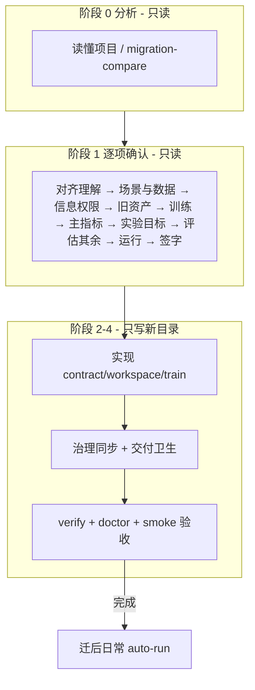

# auto-nn-init

把一个业务项目接入本模板（STEER）：统一成 `ExperimentBase` + `contract/`（口径）+ `workspace/`（实现）。

- **入口 A — 迁入已有项目**：旧代码只读，新建目标目录，选择性移植。
- **入口 B — 从零立项 / BUILD**：无旧代码（落盘标记 `# greenfield`，非四场景枚举）。

> **这份 SKILL 管「对用户怎么说」。** HARD-GATE 的内部编码、逐项问话内容、gate/矛盾检查、F1 与验收模板、contract/metrics/nn-config/executor 细则，全部在同目录 **[`hard-gate-reference.md`](hard-gate-reference.md)**（agent-only，用户不看）。**人话翻译单一真源**（init + 迁后共用）：[`docs/skill-glossary.md`](../../../docs/skill-glossary.md) §项目初始化。**人读版说明与好/坏示例**见 [`docs/init-conversation-guide.md`](../../../docs/init-conversation-guide.md)。执行时你**按 reference 的编码推进**，但**对用户只呈现人话**（见下「用户可见交互协议」）。

## 五阶段流程



| 入口 | 阶段 1 主题顺序 | 共几步 | 目标目录 |
|------|----------------|--------|----------|
| **A 迁入** | 对齐 → 场景与数据（前两问）→ **信息权限** → 场景与数据（后两问）→ 旧资产清理 → 训练方式 → **主指标 → 实验目标** → 评估与其余成绩规则 → 运行设置 → 签字 | **27** | **必须** `new-project.sh` 新建，从旧项目选择性移植；禁止 `cp -r` 整包、禁止原地改旧仓 |
| **B 立项** | 对齐 → 场景与数据（前两问）→ **信息权限** → 场景与数据（后两问）→ 训练方式 → **主指标 → 实验目标** → 评估与其余成绩规则 → 运行设置 → 签字 | **24** | `new-project.sh`（BUILD；标记 `# greenfield`） |

**铁律**：签字（F1）**不等于**完成；完成 = 跑验收脚本 exit 0 **且** 短训通过。阶段 0–1 **只读**，签字前不改任何代码。

**对照两臂**：各走一遍完整立项。答卷只差训练「可以加」里有没有 **场监督 data-loss**（常见可试；不另弹卡片）。禁止克隆后改合同开关、禁止用改能力造对照臂。说明书写必须留着什么、可以加什么；不要把诚实臂讲成「不许偷看 / 不许抄场」。工作区可以预留场监督选项、默认不用；开治理臂只有训练里真打开才拦。

**第 4 种触发：答案清单 / 草稿**（`/auto-nn-init <target> --answers 文件`）——同一份问卷、同一题序、同一套记录与签字。文件可以是标准 YAML，也可以是 md/txt/一段笔记（你先填成 YAML 再校验）。写清且合法的题不弹卡片；没写的、猜的照问。详见下文「答案清单（--answers）」。

## 问答忠实 log（init-qa-log）

每步用户确认后、**下一问发出前**，必须 append 到 `<project_root>/.auto-nn/init-qa-log.md`（逐步 transcript；**不**替代口径汇总终稿）。细则见 reference [`init-qa-log`](#init-qa-log问答忠实-logauto-nninit-qa-logmd)。

| 事件 | 命令（在目标仓或 `--repo-root <target>`） |
|------|------------------------------------------|
| 定入口 + 目标目录 | `append-init-qa-log.py init-header --workflow build\|migrate\|update --target-root …` |
| P0 / 每编号确认 | `append-init-qa-log.py append --step … --slug … --theme … --ask … --options … --user … --lock …` |
| 口径汇总签字 | **先** `close --user … --contradiction-fail 0`；**再**写 `migration-summary.md`；**再** `init_answers.py export --repo-root <target>` 吐下次可复用答卷 |

目标仓尚无脚本时：`<template_root>/template/package/scripts/append-init-qa-log.py`，`PYTHONPATH=<同目录>/scripts`。

**并行**写入统一活动 log（同触发点；开关 `agent.skill_activity_log`，默认 true）：

```bash
python3 scripts/append-skill-activity.py append \
  --skill auto-nn-init --phase confirm \
  --summary "<人话主题>" --lock "<slug 锁定摘要>" --user "<用户原话>"
```

F1 `close` 后再 `--phase end --summary "口径汇总已签字"`。

## 禁词表（单一真源）

对用户可见的回复**不得出现**下列 token；出现 = 视为内部编码泄漏，必须改人话或拆下一轮。例外：本 SKILL.md / glossary / 指南 自身在描述"禁词"时引用。

| 类别 | 禁词（含变体） | 替换为人话 |
|------|---------------|-----------|
| 阶段编号 slug | `D1-…` … `G2-…` / `I1-…` … `I3-…` / `P0-…` | 人话主题（对齐理解 / 场景与数据 / **信息权限** / 旧资产 / 训练 / **主指标 → 实验目标** / 评估与其余 / **场景探索方案** / 运行设置 / 准备步） |
| 合同 / 签字 | `F1-contract` / `F1=` / `F1 会写什么` | 口径备忘 / 口径汇总 / （上下文已有则不重复） |
| 选项号 | `①` / `②` / `③`（要求用户回） | A / B / C |
| 等式速记 | `H1=舍弃` / `E4_PATH=①` / `E4_训内节奏=A` | 此步记… / 训内打 X 节奏 / 直接描述 |
| 子字段代号 | `E4_PATH` / `E4_训内节奏` / `E4-keys` / `CADENCE` / `E4_EVAL_FOR_KEEP` | 训内打哪条路 / 训内评节奏 / 训内返回键 / 同上 / KEEP 只看终评 |
| 块 / 标头 | `块 A` / `块 B` / `块 C` / `块 D` / `块 E` / `块 F` / `块 G` / `选后锁定` | 盘点表只落 `.auto-nn/migration-summary.md`，不贴；选后锁定 = agent 内部动作 |
| 内部概念 | `S_data` / `S_run` / `S_method` / `A_explore` / `SCENARIO_AXIS` / `SCENARIO_POLICY` / `SCENARIO_CANDIDATES` / `scenario_bindings` | 数据与指标 / 默认配置 / 方法族 / 探索档 / （写到清单时直接描述） |
| init 误称 | `人生目标` / `人生模式` | **实验目标** / **实验模式**（勿与 `/auto-nn-goal mode` 混称「人生」） |
| T1 套话 | `五档` / `五层` / `五类` / `五类表` / `按 T1 分层` / `profiles.yaml T1` / `训练目标分层` | 先点破「不是问现在用哪个 loss，是定自动改实验的边界」；建议用「必须留着 / 可以换 / 可以加 / 只能拧 / 可选技巧」 |
| README 结构 | §2 技能（`NN_TEMPLATE:SKILLS`，**init 勿改**）/ §3 立项口径 / §4 自维护 | 模板技能节 / init 锁定 / 人写笔记 |
| README 模板区 | `NN_TEMPLATE:NAV` / `QUICKSTART` / `SKILLS` / `APPENDIX` | update 时 governance-sync **只**覆盖这些区 |
| README 块名 | `D2_DATA_SPLIT` / `SCENARIO_POLICY` / `METRICS_SNAPSHOT` / `AGENT_BOUNDARY` / `PROJECT_NOTES` / `INFO_PERM` | 数据划分 / 场景 / 快照 / 硬约束 / 维护笔记 / 信息权限 |
| 信息权限内部键 | `INFO_PERM` / `eval_only_assets` / `eval_only_readers` / `official_path` / `official_path_impl` / `strict_no_train_files` / `train_batch_keys` / `IP1`…`IP5` / `G-信息权限` | 训练许用材料 / 只评资产 / 允许读只评资产的合同文件 / 官方打分通道 / 手续函数 / 训练不读数据文件 / 训练 batch 键白名单 / 训练前信息权限守门 |
| 答案清单内部件 | `resolved` / `skip_ui` / `confirm_required` / `init-answers.resolved.json` / `info_perm_flags` / `guessed` / `confirm_only` | 按你清单填 / 这题不弹 / 清单与源项目不一致需确认 / 清单校验结果 / 我猜的 / 完整表只签字 |
| 文件 / 概念名 | `EXPERIENCE` / `KEEP` / `台账` / `checkpoint` / `ckpt.pth` / `results.tsv` / `exp_* 命名目录` | 经验记录 / 历史最好成绩 / 成绩记录表 / 训练中途存档 / （具体后缀） / 成绩记录文件 / 按 exp_xxx 规律起的实验目录 |
| 内部 action | `migration-compare` / `governance-sync` / `verify-migration-complete` | 跑对照分析 / 同步治理 / 跑验收（仅阶段 0/3/4 系统消息可保留，提问中改人话） |
| 迁后/实现术语 | `finalize_round` / `Run Context` / `run context` / `contract.test` / `ws.evaluate` / `improve_mode` / `primary_delta` / `ledger` / `journal` / `keeper` / `scenario_id` / `HARD-GATE` | 每轮收尾规则 / 运行参数写进成绩表 / 训末官方测试 / 训内打分 / 怎么判更好 / 主指标差多少算改善 / 成绩记录 / 实验日记 / 历史最好那次 / 场景编号 / 逐项确认口径 |
| 版本 slug 习惯 | 以 `v2`/`v5` 作主语指项目 | 源项目 / 上一版实验目录 / 本项目（用户先提版本号时可括号补充） |

**对照权威**：与 [`docs/skill-glossary.md`](../../../docs/skill-glossary.md) §项目初始化「违规自检 / 替换动作」同步；维护者侧机器校验设施归独立仓管，**业务仓不可见**。

### 已退役 token（历史记录，不复问）

> 下列 token 已并入新机制，**不再向用户发问**；老项目 `init-qa-log` 可能仍含，仅作历史识别，不触发替换动作。

| 旧 token | 归宿 |
|----------|------|
| `G0-exploration-style` / `agent.exploration_style` | 2026-07 并入 **v1.21.0 探索模式单旋钮**（G1 6 档收口 4 档节奏） |

### 替换示例（5 条）

| 主题 | 坏（泄漏） | 好（人话） |
|------|-----------|-----------|
| H1 旧台账 | 写 F1-contract 记录「H1=舍弃」；新项目 _runs/ 从零开始 | 把"源项目是空教程仓，无历史台账"写进口径备忘，此步记"无可清理"，新项目从零开始 |
| H3 旧文档硬约束 | H3=舍弃，不写 README 的 AGENT_BOUNDARY 块 | 此步记"无硬约束"，新 README 不写硬约束段 |
| E4 训内评估 | E4_PATH=①-delegate-test，E4_训内节奏=A | 训内打整包官方测试，频率每圈评 |
| O2 GPU 与并行 | O2-gpus-parallel: max_parallel=2 | 默认最多 2 路并行；指定 GPU 白名单 [0,1] |
| F1-contract 签字 | F1-contract 锁定后阶段 2 开始 | 口径汇总签字后，阶段 2 开始改代码 |
| 训练里什么能动 | 按 T1 五档分层：硬约束=…；允许替换=… | **不是**问现在用哪个 loss。先说「定自动改实验的边界」；再用白话列：必须留着 / 可以换 / 可以加 / 只能拧 / 可选技巧 |

## 用户可见交互协议（核心）

**语言 / Language**：用户这条消息主要是英文 → 进度抬头、四段式、A/B/C、衔接句全部用英文（见下文英文抬头与选项）；主要是中文 → 用中文。内部 `hard-gate-reference.md` 仍按中文编码推进，**不要**把内部表翻译给用户。

阶段 1 与用户对话时，**只**用下面这套人话外壳。内部编码一律不出现在给用户的消息里；翻译对照见 [`docs/skill-glossary.md`](../../../docs/skill-glossary.md) §项目初始化。**禁词完整清单见上节"禁词表（单一真源）"。**

**双层呈现（硬规则）**：[`hard-gate-reference.md`](hard-gate-reference.md) 里的【现状】/【为什么问】/【选后锁定】/【确认选项】①②③ 是 **Agent 内部工作表**，用来规划 F1 落盘与 `init-qa-log` 的 `lock` 字段——**不得整段复制给用户**。对用户只发本文 **四段式** + A/B/C；`append-init-qa-log` 的 **`ask` 字段须与用户看到的问句一致**（人话），`lock` 可技术化但用户本条消息里不得出现 lock 原文。

### 1. 每轮带进度抬头

每一轮**只问一件事**，开头一行给人话主题 + 进度：

```
【信息权限 · 第 3 / 共 27 步】
```

英文用户：

```
[Who can see what · step 3 / 27]
```

进度怎么数：见 reference「编号速查」的序号（入口 A 27 步 / 入口 B 24 步；机器可读：`python3 scripts/init_answers.py steps --workflow migrate|build`）。第一轮的「对齐理解」记作准备步，可写 `【对齐理解 · 开始前确认】`。

**主题块衔接**（进入新块的第一轮，进度抬头下加一行，≤1 句）：

| 人话主题 | 衔接句（示例） |
|----------|----------------|
| 场景与数据 | 接下来几轮把「有哪些实验场景、数据怎么分、复现锁哪套数据」定死。 |
| 信息权限 | 接下来三问定死：训练能用哪些材料、官方分从哪条路出来、还有没有别的信息规矩。 |
| 旧资产清理 | 接下来看旧仓里的成绩记录、经验文档、README 硬规则要不要带过来。 |
| 训练方式 | 接下来定一条规矩：以后自动改实验时，训练目标这块什么碰不得、什么可以动。 |
| 主指标 / 实验目标 | 接下来定拿什么打分、这轮追什么、目标值多少。 |
| 评估与成绩记录 | 接下来定怎么评、成绩表长什么样、怎么判「更好」、探索怎么轮转。 |
| 运行设置 | 最后几轮定机器占用、并行、起手扫参力度和随机种子。 |

### 2. 四段式问句（默认）

每个问题对用户只写四段，能不写术语就不写。**第一段 mandatory**——让普通程序员不用查文档也能懂「这一步在定什么」：

0. **这一步在定什么** — **1 句**白话或程序员类比（见下节速查表 + reference「对用户一步白」）；禁止 slug / 函数名 / 文件名。
1. **我看到的现状**（入口 B 写「模板默认」）— 3～5 条要点，从代码/盘点归纳，别堆术语。
2. **我的建议** — 一句推荐 + 必要时一句「为什么」。
3. **你怎么选** — 给人话选项 A/B/C：

```
A) 按我的建议来（推荐）
B) 保持现状不变
C) 我来改：______
```

英文用户：

```
A) Go with my recommendation (recommended)
B) Keep it as it is
C) I'll specify: ______
```

四段式英文标签：**(0) What this step decides** · **(1) What I see** · **(2) My recommendation** · **(3) Your choice**。衔接句把上表中文示例译成一句英文即可，不要另造流程。

> **迁入（入口 A / workflow=migrate）·「推荐」铁律（必遵）**  
> 「我的建议」与选项上的 **（推荐）** 标签，**必须优先落在与源项目对齐的选项**（数据划分、训内是否看 test、默认增强、主指标含义、调用链默认行为等——凡源码可核对的设定）。  
> **禁止**把「更公平 / 更规范 / 教科书式」改进（如从源设定改成 train/val/test 三段、禁止训内看 test 等）标成推荐；这类只作备选，并写清「会与源项目旧表不同口径」。  
> **从零立项（入口 B / build）** 才可默认推模板理想评估（公平划分等）。  
> 细则与 D2 键表见 [`hard-gate-reference.md`](hard-gate-reference.md)「迁入推荐铁律」。

> **必须用工具调用呈现可点选选项**（Claude Code 调 `AskUserQuestion` 工具；Cursor 用 option 卡片）；**禁止纯文本 A/B/C 或数字编号让用户手敲**。不要让用户回 `①` 配「选后锁定 / 口径备忘会写什么」这类内部表——那是你内部记录，不给用户看。
>
> **主推例外**：`--fast` 路线跳过 picker UI + 看项目答 27 步——由 in-tmux Claude CLI **扫描项目**（backbone/ datasets/ main.py / pyproject.toml）→ 一次性答 27 步 → 写 init-qa-log + close → 继续 phase 2-4。**默认走 picker**，必须用户/父 Agent 明示才走 fast。详见下文「fast 路线」章节。

**用户确认后（可选，≤1 句）**：下一问发出前，可单独一行 recap，例如「好，旧成绩表不带过来，新项目从零记。」——**不要**贴 lock 原文或编码；recap 不进 `ask` 字段，必要时写入 `user` 或省略。

**项目别名**：对话里用「源项目 / 上一版实验 / 本项目」；**不要**用 `v2`/`v5` 当主语（除非用户先这么说）。业务 backbone 名（ResNet、DPN）可保留，须一句说明角色。

### 2.1 程序员白话速查（一步白，四段式第 0 段用）

| 人话主题（步内） | 一步白（示例，可改写） |
|------------------|------------------------|
| 场景清单 | 要支持几种「官方实验设定」，各自起跑配置是什么。 |
| 数据划分 | 训练/验证/终评怎么分；终评用哪套数据。 |
| 训练许用材料 | 训练时哪些数据能碰、哪些只能等打分时才打开（像 CI 里的 secrets：跑测试才解密）。 |
| 官方打分通道 | 官方分必须走哪条路算出来：多数是模型看输入直接出结果；必须走规定手续、不能换一条路算，选受限路径（像接口只准走网关）；必须在指定状态下打分，选固定评测态。 |
| 其他信息规矩 | 除了上面两条，还有没有别的信息不许乱流（机器只管得住训练 batch 里有哪些键，其余记下来人审）。 |
| 训内数据处理 | 数据加载、增强写在代码哪一层。 |
| 复现数据 | 复现实验时要锁哪套数据路径/版本（像锁 Docker 镜像 tag）。 |
| 旧成绩与产物 | 旧成绩表和实验目录留不留（像要不要迁 CI artifact）。 |
| 旧经验文档 | 旧「踩坑笔记」要不要写进新项目。 |
| 旧 README 硬规则 | 旧文档里「必须 SGD」这类硬规则要不要保留。 |
| 训练里什么能动 | **不是**问「现在用哪个 loss」。是定：以后自动改实验时，训练目标的**底线与松紧**（什么必须留着 / 可换 / 可加 / 只能拧旋钮）。禁说「五档/五层」。 |
| 调用链 | 训练循环怎么转：几层循环、何时打分（≤6 行流程图式描述）。 |
| 主/辅指标 | 主分是什么、还有哪些辅分（像 KPI + 辅助 metric）。 |
| 实验模式 | 这轮主攻把分做高，还是也要逼 Agent 试新方法。 |
| 主指标目标值 | 主分要到多少算「达标可以停」（像 SLO）。 |
| 指标列分级 | 哪些分写进成绩表主列、哪些只当备注。 |
| 官方终评 | 训**结束后**那次正式打分怎么跑（不是训内）。 |
| 训内评估 | 训练**过程中**要不要打分、多久打一次。 |
| 记录表列 | 成绩表（TSV）有哪些列、分哪几块（像 DB schema）；固定带基线角色列。 |
| 场景探索方案 | 每轮允许改什么、多场景怎么轮换、最好成绩怎么分开比。 |
| 运行参数进表 | 哪些超参要记进成绩表方便事后对照（像 experiment metadata）。 |
| 模型存档 | 要不要存权重、存最好一轮还是最后一轮。 |
| 怎么算更好 | 什么情况下算「这次实验更好、要留下来」（像 promote 规则）。 |
| 训练墙钟 | 单次训练最长跑多久（超时 kill）。 |
| GPU 与并行 | 用哪些卡、最多几路同时训。 |
| 起步尺子 | 该场景先跑朴素基线（plain）与公开对照（reference）；测条件要对齐。 |
| 复现随机性 | 随机种子、确定性设置（像 CI 可复现构建）。 |

人读「问什么、拿不准怎么答」：开源仓首页 [README-zh 附录](../../../README-zh.md#init-qa) / [README appendix](../../../README.md#init-qa)。对话进度与好/坏示例另见 [init-conversation-guide](../../../docs/init-conversation-guide.md)。对用户只用人话；本表只给你写四段式第 0 段。

### 3. 阶段 0 不要轰炸盘点表

读完项目后，对用户只讲 **3～5 条人话理解**（这是什么任务、数据怎么来、拿什么打分、有什么风险）。完整的逐项盘点（块 A–F）**写进 `.auto-nn/migration-summary.md` 存档**，不要整张贴给用户。

### 4. 对齐理解（开场，对应内部 P0）

进入逐项确认前，先用人话讲「我对这个项目的理解」，请用户确认或纠正：

```
【对齐理解】这是我对项目的理解，对吗？
- 任务：…
- 数据：…
- 怎么打分 / 留最好成绩：…
- 我注意到的 1～2 个风险：…
- 对象类型 / 改码能碰多深：…（如"注册制框架，只能走 register，不能动框架源码"）

A) 没问题，开始逐项确认
B) 有偏差，我帮你改：______
```

用户确认后，**才**进入下一主题。**立即** append `init-qa-log`（见上节）；口径细节在 F1 签字时一并写入 `.auto-nn/migration-summary.md`。

**对象类型判定（代码级 HARD-GATE，P0 内）**：对齐理解必须按 **3 workflow + 3 object_type** 读码，并跑 **`align_probe`**（`python3 scripts/init_align.py probe --repo-root … [--source-root …]`）拿 profile/深度建议与证据；确认后 **`init_align.py write`** 落盘 `.auto-nn/init-align.json`。手册生成以该文件为准。纯数据源禁止 migrate（改 BUILD + 挂数据）。`--profile` 与探针冲突须 `--accept-profile-override`。O3 非 skip → `write_baseline_start_intent.py` 或 `.auto-nn/baseline-intent-skipped`。

1. **3 object_type 维度**：agent 读 source_root **代码** → 按下表信号判对象类型 + 拿代码证据：

| workflow (3) | object_type (3) | 入口 | 步数 |
|--------------|------------------|------|------|
| build(无 source_root) | data(无 .py)/ code(.py + 无 @register_*)/ framework(@register_* 命中) | B(从零搭) | 24 |
| migrate(source_root ≠ repo_root) | 同上三分类 | A(迁入) | 27 + 决策 1-3 |
| update(source_root == repo_root) | 同上三分类 | A(二次 init,增量) | 15 |

2. **migrate pattern 维度**（仅 workflow=migrate 走此分支）：migrate 走完后，看源仓有没有 contract/：
- 无 contract/（老 migration 路径） → pattern=port_to_contract（拆数据/指标/模型/loss）
- 有 contract/（老 adapter 路径） → pattern=workspace_wrapper（workspace 翻译 cfg ↔ 外部框架）

3. **HARD-GATE**：代码看不完 / 两维度没判全 → **不准结束对齐理解环节**，更不进 picker。

**对象类型确认（随 P0 一起 append init-qa-log，不新增 picker 步）**——picker 26/29 条硬计数 + schema 不动，对象类型锁定挂在 P0：

```
【对象类型】我读了你的代码，这个项目是"哪种对象"——改码能碰多深：
- 我看到的现状：[deps 含 lightning + 有 registry hook] → 注册制框架
- 我的建议：[agent 判的对象类型]，因为 [代码证据]
A) 按我看代码的结论（推荐）
B) 我觉得是别的：______
```

人选 A / 与 agent 一致 → 落 agent 结论；人选 B（异议）→ **agent 推翻**：代码证据优先，仍落 agent 结论；`init-qa-log` 记"人选 X / agent 推翻为 Y / 证据 Z"，对话里一句人话解释。结论写进 `framework.{name,mutability}` → 驱动 manual 生成。

### 5. 签字（对应内部 F1-contract）

27/24 步全部确认后，**单独一轮**给一张「口径汇总，请最终确认」的表（**仅人话行名**，禁止 slug / 函数名 / yaml 键），并说明：**这一步只是锁定口径，不代表迁移完成**；确认后才动代码。

**人话汇总表行名（示例，按项目删减）**：

| 人话行名 | 你已选（示例写法） |
|----------|-------------------|
| 实验任务与 profile | 监督学习 · CIFAR-10 分类 |
| 场景与起跑配置 | reference 对照库 + automatic 自主提方法；各 1 行清单 |
| 数据划分与终评 | 官方终评 = 测试集；训内同指标不同 loader |
| 信息权限 | 训练只用训练份，测试集只评（合同 test 文件可读）；官方分整网前向；无其他规矩（来源：清单） |
| 旧资产 | 不带旧成绩表；经验文档重写；无硬约束 |
| 训练循环 | 标准 epoch 循环；训内每圈评；主 loss 不可改 |
| 主指标与目标 | 准确率；先追指标；目标 0.85 达标即停 |
| 探索与更好判定 | 每轮只换架构；两场景分开比最好；改善阈值 0.001 |
| 机器与复现 | 最多 2 卡并行；单轮最长 2h；种子 42 |

用户确认后：**先** `init-qa-log close`，**再**把完整 F1-contract（含编码行名、矛盾检查）落盘到 `.auto-nn/migration-summary.md`——见 reference；**编码表不对用户展示**。

### F1.5（仅 1 次性，F2 之前）

读 profiles.yaml default_watchlist → 推荐 5~10 keys → 写 `nn-config.yaml["ledger"]["watchlist"]`（**系统键 `baseline_tag` 钉死**，求交不可丢）：

```bash
python3 scripts/init_watchlist.py --profile <F1 选的 profile>
```

写完再 append `migration-completed-checklist-<ts>.md` 到 `.auto-nn/`：
- 内容：当前 watchlist 列表 + 触发的 `_render_watchlist_suggestion()` 抓拍（顶部 5 项）
- 命名：`migration-completed-checklist-$(date +%Y%m%d-%H%M%S).md`

### 5.1 实验目标（块 G；**E1-metrics 之后、场景探索方案 E6 之前**，两轮）

> **2026-07 合并说明**：原 G0 探索风格 (4 档) 已在 v1.21.0 探索模式单旋钮中收口为 6 档，不再单独问。本节 G = **两轮**：**G1-experiment-mode**（先选）→ **G2-goal-value**（后钉）。块 G 内不再出现 G0 题号。

**主指标（E1）问完后**，进入 **实验目标** 主题（**两轮**：先选**实验模式** G1，再钉**主指标目标值** G2；仍一次一问）。须**先于**「场景探索方案（E6）」——探索方案与**实验目标**紧密相关。与「起步尺子（O3）」分工：O3 在 G + E6 之后，定该场景是否起步跑 **plain + reference**、找推荐对照并核对测试条件（找不到请用户给）；起手改哪一类由 G1 `exploration_mode`→`tier_start` 隐含，**不再**问旧四档。

#### 5.1.0 实验模式（G1；6 档）

```
【实验目标 · 第 14 / 共 27 步】
- 我看到的现状：主指标是「…」（上一步 E1 已确认）；模板默认是「先把主指标做上去」。
- 这一步在定：项目整体方向（5 显式档 + auto = 6 选 1）。
  - 5 显式档：自己管升档（撞墙后 reflect 写建议，不动 yaml）
  - auto 档：放手让系统撞墙自动升档（optimize → innovate → aggressive；aggressive 撞墙停止）
- 我的建议：多数项目先 optimize ⭐；想深改方法选 innovate；全力冲选 aggressive；想"放手"选 auto。
- 另外两个一般不用：careful = 照手册原样跑、啥都不动；explore = 纯摸底不追指标（须迁后验收完成再开）。
- 你怎么选：
  A) careful（啥都不动，照手册做；起手 A 标量；reflect 间隔 2 轮避免扰动）
  B) optimize ⭐（标准干活，追指标；起手 A 标量；reflect 间隔 1 轮）
  C) innovate（撞墙翻同行代码；起手 B 结构；reflect 间隔 1 轮）
  D) aggressive（论文+文档+实现+生态全查；起手 D 数据；reflect 间隔 1 轮）
  E) explore（啥都试，不被指标卡；不 hard-stop on goal；reflect 间隔 1 轮）
  F) auto（放手让系统撞墙自动升档；起步 optimize，5 轮撞墙升 innovate，再 5 轮升 aggressive；aggressive 撞墙停止）
```

回 B → 内部写 `exploration_mode: optimize`（顶层单旋钮）；A/C/D/E/F 写 `careful` / `innovate` / `aggressive` / `explore` / `auto`。**不对用户展示**任何 `exploration_mode` 等编码；只翻人话。G1 确认后落盘（见 reference 块 G G1 节），不在对话里贴编码。

#### 5.1.1 主指标目标值（G2）

按 G1 6 档与 **E1 指标族**分支问（对用户仍四段式；**不对用户展示**内部模式名）。**须说明**：「最终目标」与后面 E9「单次算不算更好」是两条线。

**careful（A）**

```
【实验目标 · 第 15 / 共 27 步】
- 这一步在定：主指标要到多少算「最终达标、自动停」（careful 档 = 保守，建议设低一点的目标值）。
- 我的建议：careful 不强求完美；多数项目 0.85-0.90 即可。
- 你怎么选：
  A) 目标 0.85
  B) 目标 0.90
  C) 目标 0.95
  D) 暂不设
```

**optimize / innovate / aggressive + M1 比例类准确率 + 简单分类（MNIST / FMNIST / CIFAR-10 等）**

```
【实验目标 · 第 15 / 共 27 步】
- 这一步在定：主指标要到多少算「最终达标、自动停」。
- 我看到的现状：主指标是「测试集准确率」；G1 你已选 <optimize/innovate/aggressive>。
- 我的建议：
  · optimize → 0.95 较易 / 0.98 中等 / 0.99 难
  · innovate → 0.98 中等（创新档可设稍高）
  · aggressive → 0.99 难（全力档可冲最高）
- 你怎么选：
  A) 目标 0.95
  B) 目标 0.98
  C) 目标 0.99
  D) 暂不设
```

**optimize / innovate / aggressive + M2/M3/M4 损失 / 误差 / 相对误差 / M5 RL 回报**

```
【实验目标 · 第 15 / 共 27 步】
- 这一步在定：主指标最终要到多少算达标即停。
- 我的建议：默认「暂不设」，避免拍错目标过早停或永远停不下来。
- 你怎么选：
  A) 暂不设（推荐）
  B) 我已有目标：______
  C) 自定义：______
```

**explore（E）**

```
【实验目标 · 第 15 / 共 27 步】
- 我看到的现状：你选了「先摸底」；默认不设数值主目标。
- 我的建议：摸底期不设硬目标；若担心指标崩，可加一条「不低于 ___」的护栏（可选）。
- 你怎么选：
  A) 不设数值目标（推荐）
  B) 设护栏：主指标不低于 ______
  C) 暂跳过
```

**auto（F）**

```
【实验目标 · 第 15 / 共 27 步】
- 我看到的现状：你选了「放手让系统撞墙自动升档」；auto 起步 optimize，撞墙后升 innovate → aggressive。
- 这一步在定：auto 模式下 effective_mode 实际生效档的硬停线（注意：auto 撞墙后 mode 会自动变；G2 设的目标值是 effective_mode 实际档的硬停线）。
- 我的建议：auto 起步 = optimize，跟 optimize 同档位建议。
- 你怎么选：
  A) 目标 0.95
  B) 目标 0.98
  C) 目标 0.99
  D) 暂不设（auto 撞墙后 hard-stop 取决于 effective_mode 实际档的 goal_value）
```

> 用户回 A 给数 → 内部写 `exploration_mode`（G1 所选档）+ `goal_value=<数值>`；回 D「暂不设」→ 不写。**不对用户展示**数值以外的编码。G1/G2 确认后内部落盘（见 reference 块 G），不在对话里贴编码。

**多场景补充（清单 ≥2 档）：** 在 G2 主目标问完后，若用户需要「各档不同目标」或「全 active 达标才停」，用一句人话确认停批范围；内部写 `goal_stop_mode` / `scenario_goals`（见 reference G2b）。默认仍 **只盯主场景**（`focus_only`）。

### 5.2 场景探索方案（E6；**G1/G2 之后**，条件必问）

**对用户主题**：场景探索方案（**不是**再问「要不要探索」——**实验目标**已在 G 定过）。

```
【场景探索方案 · 第 20 / 共 27 步】
- 我看到的现状：
  - 你已选：{G1 人话主线，如「先把主指标做上去」}
  - D1 已锁场景：reference（对照库）/ automatic（Agent 自主提出）…
  - 本步只定：每轮允许改什么、一次专注几个场景、最好成绩怎么分开比
- 我的建议：（按 G1 分支，见 reference E6 表；例：只换模型架构，超参先不动，一次专注一个场景，两个场景分开比 KEEP）
- 你怎么选：
  A) 按建议来（推荐）
  B) 每轮允许多样东西一起改（模型+优化器+增广…）
  C) 固定单一架构，不换模型（仅冒烟）
  D) 我来说：______
```

**禁止**在选项里裸写 `SCENARIO_AXIS`、`A_explore`、`focus`。须写清 **reference 对照库 ≠ 绑死所有探索**；automatic 场景下 Agent 可自主提方法。

### 5.3 怎么算更好（E9；E8 之后）

**对用户主题**：单次实验算不算「比历史最好更好、要留下来」（**不是** G2 的最终目标）。

Agent **必须**查 E1 内部 `metric_family` 与 [`metric-family-keep-presets.yaml`](metric-family-keep-presets.yaml)（或 reference E9 表），给 **≥3 档 + 理由 + 推荐 A**；**禁止**快速路径确认模板默认 0.5%；**不要求** baseline / smoke / 旧 TSV。

**M1 比例类示例（FMNIST / 分类准确率）**

```
【怎么算更好 · 第 23 / 共 27 步】
- 这一步在定：单次实验比历史最好「好多少」才算更好、要留下来（和第 12 步「最终目标」不是一条线）。
- 我看到的现状：主指标是「测试集准确率」，越大越好；成绩按场景分开比（E6 已确认）。
- 我的建议：这是典型的比例类准确率。不用先跑实验，按指标性质先定进步线；以后觉得太松或太严可以改配置。
  · 推荐：涨 0.1% 就算更好 — 高平台期常见波动在这一档，适合微调
  · 若只想留大改动：涨 0.5% — 旧默认，可能很多轮都留不下
- 你怎么选：（option 卡片）
  A) 涨 0.1%（推荐）
  B) 涨 0.2% — 略严，仍允许稳定小步
  C) 涨 0.5% — 只留明显跃迁
  D) 自定义：______
```

**其它指标族**：按 reference [E9-keep](hard-gate-reference.md#e9-keep--keep-进步线按指标族选型) / presets 生成对应 A/B/C/D 与理由（M2 损失、M3 误差、M4 rL2、M5 回报、M6 其它）。

用户选档后：init-qa-log `lock` 含档位人话；F1 写「单次进步线」；阶段 2 写 `nn-config.yaml` `keep` 段（见 reference）。

### 绝不对用户暴露

完整禁词清单与替换表见上节「**禁词表（单一真源）**」；机器可校验版本见 [`docs/skill-glossary.md`](../../../docs/skill-glossary.md) §项目初始化「违规自检」。**绝不对用户暴露**：所有阶段 slug（`H1-…` / `E4-…` / `O2-…` / `G0-…` / `G1-…` / `I1-…` …）、合同/签字（`F1-contract` / `选后锁定` / `F1 会写什么`）、子字段代号（`E4_PATH` / `CADENCE` …）、块 A–G 全量盘点。需要这些时查 reference，对用户翻成人话。

### 一轮一问（硬规则，v1 保守并联）

阶段 1 **默认**每条回复只推进 **一个** slug。仅当 `docs/init/init-interaction-policy.yaml`（业务仓 sync 路径，fallback 见下）命中 **同一 bundle** 且依赖已满足时，允许 **同轮 ≤2 个独立子题**（各有一套 A/B/C，禁止合并成单选题）。

**读 policy 顺序：**
1. `<project_root>/docs/init/init-interaction-policy.yaml`
2. `<template_root>/template/package/docs/init/init-interaction-policy.yaml`
3. 皆无 → 严格单题（等同现网）

**并联轮硬规则：**
- 1 个主题块抬头；子题各含「这一步在定什么」
- 提供「分开问」选项；用户选则下轮拆成单题，本轮不 append
- 用户答完后 **按 slug 各 append 一次** `init-qa-log`
- 禁止 Agent 自行发明 bundle

### 发出前 4 问自检（硬规则）

发出本条用户可见消息前，agent **必须**自问下面 4 问，任一不通过则改或拆下一轮：

1. **一步白**：四段式第 0 段「这一步在定什么」是否存在且 ≤1 句、无禁词？缺失 → 补；过长 → 拆到 reference 速查表一句。
2. **主题数**：本条主题块抬头是否 ≤ 1？若并联，子题是否 ≤2 且 policy 同一 bundle、入口/依赖满足？
3. **禁词**：是否出现本 SKILL「禁词表（单一真源）」任何 token？出现 → 改人话，或移到括号补充，或删。
4. **选项格式**：是否用了纯文本 A/B/C 或数字编号让用户手敲？出现 → **必须改为工具调用**（Claude Code 用 `AskUserQuestion`；Cursor 用 option 卡片）；**禁止文本选项让用户手敲**。

> 自检是「一轮一问」与「禁词表」的**执行闸门**：四问任一失败，本条不许发出。维护者侧机器校验设施归独立仓管，**业务仓不可见**。

## 阶段命令（单一事实源在 reference）

```bash
# 阶段 0 分析（入口 A，对旧项目跑）
bash <template_root>/scripts/migration-compare.sh --template-root <template_root> --project-root <source_root>

# 带 --answers：先识别标准答卷 vs 草稿；草稿须先填表再校验。rc 1 → 先把错误人话贴给用户，整份清单不生效
python3 <template_root>/template/package/scripts/init_answers.py classify --answers <文件>
python3 <template_root>/template/package/scripts/init_answers.py validate \
  --answers <清单.yaml> --workflow build|migrate|update --repo-root <target_root> --write-resolved

# 口径汇总签字后：从问答记录导出下次可复用答卷（默认 <target>/.auto-nn/init-answers.yaml）
python3 <template_root>/template/package/scripts/init_answers.py export --repo-root <target_root>

# 建目标仓（入口 A/B 都用；入口 A 在「对齐理解」前先给 1~3 条 target_root 建议待用户拍板）
<template_root>/scripts/new-project.sh <target_root> <项目名> --profile supervised|rl|physical

# 阶段 2 首步：信息权限三问落表（写 contract/runtime.py INFO_PERM + README INFO_PERM 块，脚本自动对账）
cd <target_root> && python3 scripts/init_info_perm.py write --repo-root . --from-resolved .auto-nn/init-answers.resolved.json  # 有清单
cd <target_root> && python3 scripts/init_info_perm.py write --repo-root . --consumes A|B|C [--eval-only-assets …] --official-path A|B|C [--official-path-impl …] --other-rules 均无  # 现场答

# 阶段 2（写 ABCDE manual — F1 签字后、改代码前；与 O3 尺子问话解绑）
# 入口 A/B 必跑；写 references/manual/abcde-manual.md（5×3 思维框架 + framework 元信息头注释）
# 入口 A 需 --source-root 指向旧仓；入口 B 留空。
# --force-workflow 取 F1 picker 答的 workflow（build|migrate|update）
# --force-object-type 取 P0 对齐锁定的 object_type（data|code|framework；必带，压过 detect 误报）
# 闸门：F1 签字后、写代码前必跑；缺文件则立项/验收失败（new-project exit≠0；doctor abcde_manual FAIL）
python3 <template_root>/scripts/init_o3_abcde.py \
  --repo-root "<target_root>" \
  ${SOURCE_ROOT:+--source-root "<source_root>"} \
  --force-workflow "<F1 答的 workflow>" \
  --force-object-type "<P0 锁定的 object_type>"

# 决策 1-3: 仅 workflow=migrate 才有
决策 1: 源仓是否在 site-packages?(是 → workspace_wrapper;否 → port_to_contract)
决策 2: workspace_wrapper 翻译字段是否漏?(回查外部框架 CLI/API)
决策 3: port_to_contract 拆 prepare_data/metrics 是否与源一致?(回查源 train.py)

# 阶段 3 治理同步 → 阶段 4 验收
bash <template_root>/scripts/governance-sync.sh --template-root <T> --project-root <P>
# governance-sync.sh 内部已调 abcde_migrate.py（Layer A）：老业务仓也会尝试补写；失败不替代存在性门禁
# 若 init_o3_abcde.py 已写过，abcde_migrate.py 会 idempotent skip（双写防漏）
cd <target_root> && bash scripts/check-env.sh                  # 换机后：FAIL → poetry install
cd <target_root> && bash scripts/verify-migration-complete.sh   # 必须 exit 0（含 abcde-manual.md 存在）
cd <target_root> && python3 scripts/info_perm_gate.py .           # 信息权限块 ↔ 合同一致，exit 0
# 阶段 4 边界断言（verify 之后、smoke 之前；不可绕过）
# 硬门：references/manual/abcde-manual.md 必须存在（doctor abcde_manual FAIL）；framework 元信息头注释可解析（若适用）
bash scripts/nn-doctor.sh                                        # 0 FAIL 才继续（env_runtime + 结构体检）
bash scripts/smoke-check.sh                                      # §5 单槽短训
```

### O3-ABCDE: ABCDE 边界初始化（追加子步）

> 在 O3-baseline-anchors 尺子口径锁定之后、阶段 2 改码前；用 AskUserQuestion 弹三选一（若仍保留对象类型确认）。**不**再绑定旧 `exploration` 四档。

**题目**：ABCDE 边界初始化策略

**选项**：
- A) 默认边界（推荐） — 按当前 init workflow（`build` / `migrate` / `update`）套默认 ABCDE 边界
- B) 自定义逐档 — 弹 5×3 表格（B/C/D 档 × routine/extend/novel），每格让你选 level
- C) 宽松全开 — B/C/D 全 = extend，E 仍 lock（`migrate` 场景**禁用**）

**写入文件**：`references/manual/abcde-manual.md`（5×3 思维框架；头注释含 framework 元信息 name/mutability）

（选 B 时模板见 init 阶段 2 产物 `<target_root>/references/manual/abcde-manual.md` §3 表格）

**默认行为**：用户不答 → 按 A 路径调用 `init_o3_abcde.py`（见阶段命令）。

**场景分支**：当 `workflow == migrate` 时，对用户**不展示** C 选项（只给 A/B）；B/C/D 全开对 migrate 意义不大（migrate 改面较小，宽松全开会破坏 E 锁的兼容语义）。

**阶段 4 doctor 闸门（verify 通过后、smoke 前）**：`bash scripts/nn-doctor.sh` 任一 **FAIL → 阻断 handoff**（init 产全新脚手架/迁移，本该干净；FAIL = 真迁移缺陷），人话列 FAIL + 推荐 `/auto-nn-modify` → `/auto-nn-doctor` 确认 0 FAIL；**WARN 不阻断**（init 时 runtime_activity 无 auto-run、ledger 行数差等预期）。**0 FAIL** 时把 doctor 输出归一（每行 `检查名<TAB>状态[<TAB>计数]`）写入 `saved/doctor_last.txt`，作 [`/auto-nn-analyse`](../../post-migration/auto-nn-analyse/SKILL.md) doctor-diff 首基线。check 名按 analyse「人话翻译」表翻译（如 layout→布局、G-repro-cli→可复现 CLI、governance_rev→治理版本）。

**入口 A target_root 命名**：在「对齐理解」之前给用户 1～3 条建议（默认 `auto-nn-<任务短名>-vN`，与旧仓同父目录、新名），用户拍板后才 `new-project.sh`；`realpath(target) ≠ realpath(source)`，禁止原地改旧仓。推导启发式见 reference。

## README 三层（init 必守）

业务仓 `README.md` 分三层；**init 只写 §3 / §4 和标题**，**禁止改 §2 模板区**（含 `<!-- NN_TEMPLATE:* -->` 与 `<!-- SKILLS_* -->`）。

| 层 | 章节 | init 做什么 | update 做什么 |
|----|------|-------------|---------------|
| 模板 | §1–§2 + 附录（`NN_TEMPLATE:*`） | **不动**（`new-project.sh` 已拷贝） | 拉模板同步 → `merge-readme-template-blocks.py` **只**更新模板区 |
| 立项 | §3（`§3.1` prose + D2/场景/快照/边界） | **按 F1 填写** | **保留** |
| 自维护 | §4（`PROJECT_NOTES`） | 可写一行 init 摘要 | **保留**（人随时改） |

阶段 3 改 README 时：**改标题 + 填 §3 + 可选 §4**；勿删导航表、勿重写技能表。阶段 4 的拉模板同步会自动对齐模板技能说明，不覆盖你的 D2/场景/笔记。

## 答案清单（--answers）

> 协议真源：reference「答案清单协议（--answers）」；题库 `docs/init/init-question-registry.yaml`（业务仓经 governance-sync Init 组下发）。

**是什么**：用户把已经想好的答案交给你——**标准 YAML、md/txt、或聊天里一段笔记都行**。你先变成标准答卷再校验。有合法答案且允许跳的题**不弹卡片**，但**题序不变、每题照记、签字照签**。对用户这样说：「你写清了的题我直接采用并记录，没写的和我猜的照常一题一题问。」

**机器格式只有一种**：`version: 1` + `answers:`（键 = 人话题目）。md/txt **不是**校验器能读的格式，必须先由你填表。

### 开工怎么走

1. **识别**：`init_answers.py classify --answers <文件>` → `answers` 或 `draft`。
   - `answers`：原样校验。
   - `draft`：对照题库把笔记填成 YAML，落盘 `<target>/.auto-nn/init-answers.converted.yaml`（用户原文另存 `init-answers.input.*`，不覆盖）。**没写清的题不要编默认值**；拿不准的题加 `guessed: true`（或 `confidence: guessed`）。
2. **给人看覆盖表**（开工前一轮，人话，禁止内部编号）：

| 类别 | 怎么处理 |
|------|----------|
| 写清了 | 合法且可跳 → 不弹卡 |
| 我猜的 | 仍问；卡片里可写「笔记里像是 X」 |
| 没提 | 照常一问一答 |
| 和源项目不一致（迁入） | 必问「清单说 X，源项目是 Y」 |

3. **校验**：`init_answers.py validate … --write-resolved`。有错误 → 人话贴出，整份不生效、全部照问；只有警告 → 继续。
4. **按题序走**（与无清单相同）：查 `.auto-nn/init-answers.resolved.json`
   - 这题可跳 → 不弹卡片，一句「【主题 · 第 N / 共 M 步】按你清单填：…」，照常 `append-init-qa-log`（`--user` 以「（来自清单）」开头）；
   - 须改回确认或草稿为猜测 → 必出卡片；
   - 不在 resolved → 照常四段式。
5. 签字表每行末注「来源：清单 / 现场 / 草稿猜测」；签字永远现场。
6. 阶段 2 首步 `init_info_perm.py write --from-resolved …`（清单含信息权限三问时；`--enforce` 由 T1 常见可试 data-loss 投影，禁止再手改）。

**v1 允许跳卡的 8 题**（无完整表只签字时）：训练许用材料、官方打分通道、其他信息规矩、实验模式、主指标目标值、训练墙钟、GPU 与并行、复现随机性。其余题写了也照问（值作参考）。

**完整表只签字**：YAML 顶栏 `confirm_only: true`，且对齐理解 + 全部计步都有合法答案、**没有任何猜测标记** → 点选全跳过，**只出最后一轮口径汇总请人确认**。缺一题、或含猜测 → 不能只签字，猜的/缺的仍问。签字不能代签。迁入与源码不一致的题在完整表下写进总表对照，不再逐题弹卡。答卷由**这个项目**自备，不进模板。

### 签完导出（每次 init 必做）

口径汇总 `close` 并写完 `migration-summary.md` 之后：

```bash
python3 scripts/init_answers.py export --repo-root <target>
```

默认写出 `<target>/.auto-nn/init-answers.yaml`（以问答记录**最后一版**为准，不是用户草稿原文）。下次同类立项：`/auto-nn-init <新目录> --answers 那份.yaml`。换课题当草稿重填，不要当完整表盲贴。

结束时三份留档（运行时都不读）：问答记录、口径汇总、**标准答卷 YAML**。

**禁止**：把 md 直接当 YAML 校验并声称生效；因草稿省略问答记录或口径汇总；把猜测标成写清；用清单代签；把清单当口径汇总落盘；运行时读答卷。

`--fast` 可叠用：清单命中的题直接取清单值，其余照旧看项目答；签完同样 export。

## fast 路线（in-tmux Claude 看项目答 27 步，**主推自动化路线**）

### 触发原则（P0 — 最高优先级）

**默认走 picker 主路径。除非用户/编排器明确提示才采用 fast 路线**。

- ✅ **父 Agent / 编排器默认**走 fast（自动化场景：sandbox-debug L1 init smoke / sandbox-loop 元循环 init / 回归测试 / 冒烟测试）
- ✅ **用户明示**："用 fast" / "看项目答" / "全自动 init" / "跳过 picker"（任一明确意图即触发）
- ❌ **真人日常 init 默认走 picker**（**主动想答**有教学价值——fast 路线不替代 picker）
- ❌ 父 Agent **不**伪装真人 picker（fraud）
- ❌ 父 Agent **不**写死通用答案（须看本项目代码答；写死答案会在 phase 2 写码时暴露不适配）

### 何时用

- **自动化场景**（父 Agent）：sandbox-debug L1 init smoke / sandbox-loop 元循环 init / 批量项目 init / 回归测试 / 冒烟测试
- **真人场景**：用户明确说"用 fast 跑" / "看项目答" / "全自动 init"

### 何时不用

- 日常 init（**默认走 picker**——真人主动想答，有教学价值）
- 第一次接触某项目（picker 看 picker 让人理解每步）

### 用法

```bash
# 主路径（默认）— picker 26/29 条
/auto-nn-init <target_root>

# fast 路线 — in-tmux Claude 看项目 5-10 分钟完成
/auto-nn-init <target_root> --fast

# sandbox-init 包装（推荐）
bash sandbox-auto-nn/sandbox/bin/sandbox-init --tmux <name> --fast
```

### fast 路径 8 步流程

```
1. in-tmux Claude 检测到 --fast flag → 跳过 picker 27 步 AskUserQuestion
2. 扫描项目（3-5 秒）：
   - ls / read README / read pyproject.toml / read main.py
   - 推断 entry (A/B)；workflow：`init_workflow.classify` / `--force-workflow` → build|migrate|update
   - 推断 object_type：`detect()` / `--force-object-type` → code|framework|data
   - 推断 backbone / dataset / loss / metric / time_budget
   - 推断 framework 信号（pyproject deps / `@register_*` / site-packages → name + mutability）
3. 一次性答 27 步（10-15 秒；`--answers` 命中的题直接取清单值）：
   for step in [P0, D1, D2, ..., F1]:
       answer = agent 推断 (基于扫描结果)
       scripts/append-init-qa-log.py append --step <step> --user <answer>
4. close init-qa-log
5. 写 migration-summary.md（agent 推断的 F1 contract）
6. 写 references/manual/abcde-manual.md（阶段 2 init_o3_abcde.py；与尺子问话解绑）
7. 写 saved/baseline_start_intent.json（O3-baseline-anchors 选 A/B 时）
7. 写 contract/ workspace/ train.py（phase 2 写代码 — agent 真懂项目）
8. 阶段 3-4 治理 + verify + smoke-check
```

### 协议层产物（与 picker 路径**完全一致**）

| 文件 | 路径 | 来源 |
|------|------|------|
| `init-qa-log.md` | `<target>/.auto-nn/` | init-header + 26/29 条 + F1-contract + close |
| `migration-summary.md` | `<target>/.auto-nn/` | F1 汇总表（agent 推断的 lock 值） |
| `abcde-manual.md` | `<target>/references/manual/` | 阶段 2 init_o3_abcde.py（framework 元信息见头注释） |
| `baseline_start_intent.json` | `<target>/saved/` | O3-baseline-anchors 尺子意图 |
| `contract/ workspace/ train.py` | `<target>/` | **agent 真懂项目写的**（不是通用答案） |

### 三原则 A/B/C（fast 路线也遵守）

- ✅ **in-tmux Claude CLI 是写主体**（脚本 `scripts/append-init-qa-log.py` 仍由 in-tmux Claude Bash 工具调）
- ✅ **cwd 在副本**（`--repo-root <target>` 是副本绝对路径）
- ✅ **picker 协议层产物齐全**（init-header + 26/29 条 + F1-contract + close）
- ✅ **不破协议层**（`append-init-qa-log.py` `validate()` 只验产物不验触发方式）

### 与既有 4 种情形的协作

| 情形 | fast 路线兼容？ |
|------|------------------|
| **A — picker 过程父 Agent 代答** | ❌ fast 路线**不走 picker** |
| **A.1 — picker 内部更正前一题** | ❌ 同上 |
| **B — F1 close 后改 config** | ✅ 兼容：fast 路线 close 后仍可走 B 兜底 |
| **C — F1 close 前改 summary** | ✅ 兼容：fast 路线 F1 close 前仍可走 C 主动改 |

### in-tmux Claude "看项目" 协议（核心实现细节）

```bash
# 扫描项目（3-5 秒）
ls -la <target_root>/
cat <target_root>/README.md | head -50
cat <target_root>/pyproject.toml
ls <target_root>/backbone/ 2>/dev/null | head -10   # backbone 类
ls <target_root>/datasets/ 2>/dev/null | head -10   # dataset 类
cat <target_root>/main.py 2>/dev/null | head -50    # 训练入口
```

**推断映射**（in-tmux Claude 自己判断）：
- 无 `source_root` / 从零立项 → workflow = **build**（入口 B；落盘可写 `# greenfield` 标记）
- 有外部 `source_root` 且目标无既有 contract 迁入形态 → workflow = **migrate**（入口 A）
- 同仓二次 init（`source_root == repo_root` 且已有 contract/）→ workflow = **update**
- 看到 `main.py --model` 且无旧仓 → entry = B；`main.py` 含迁移 / 明确迁入 → entry = A
- 看到 `pyproject.toml` 含 `torch/lightning` → loss = cross_entropy
- 看到 README 提 R5 er_ace 81% → metric = er_ace, goal = accuracy ≥ 0.8
- 看到 R5 跑 4 轮共 5h+ → time_budget = 3600
- 看到 source_root 在 site-packages / pip 包 → object_type = framework, mutability = register
- 看到 `pyproject.toml` deps 含 `lightning`/`mammoth`/`avalanche` 或源码有 `@register_*` → object_type = framework, mutability = register
- 看到几乎无训练 `.py`（纯数据/csv/raw 数据集）→ object_type = data；BUILD 脚手架后须 `--force-object-type data`
- 看到自己写的训练代码（可改源码、无外部注册制绑定）→ object_type = code, mutability = source
- framework 档穷尽 register 后才 fork（旧 breakin 语义在此；**不**再有 breakin_required 档）
- **禁止**再把 `adapter` 写成可走 init 场景（ADAPTER 已退役）

**关键**：**不**写死答案，**不**脚本化推断，**in-tmux Claude 自己读项目自己答**。

### 关键不变量

- ✅ **默认行为 100% 不变**（无 `--fast` → 走 picker 27 步）
- ✅ **必须用户/父 Agent 明示**才走 fast
- ✅ **in-tmux Claude CLI 仍是写主体**（原则 B）
- ✅ **协议层 26/29 条 + F1 + close 必走**（不破）

### 依赖

- 模板仓 `auto-nn-experiment` ≥ 1.10.0（提供 `--fast` flag + fast 路线 SKILL.md 章节）
- 业务仓 ≥ 1.10.0（governance-sync 下发 SKILL.md 改动）

### 相关文档

- 设计 spec：`sandbox-auto-nn/design/2026-07-10-auto-nn-init-fast-design.md`
- 实施计划：`sandbox-auto-nn/design/2026-07-10-auto-nn-init-fast-plan.md`
- 协议层细节：`hard-gate-reference.md`（同仓）

### 不在本节范围

- ❌ 不替代 picker 主路径（日常 init 仍推荐 picker）
- ❌ 不加新 slash 技能（仍是 `/auto-nn-init`，只是多 flag：`--fast` / `--answers`）
- ❌ 不默认被编排器自动调用（必须用户/编排器明示）
- ❌ 不改 `append-init-qa-log.py` / `init_qa_log.py` 代码层

## 迁后 handoff（阶段 4 通过后，本 Skill 止于此）

| 目的 | 读哪里 |
|------|--------|
| 历史最好成绩 / 指标 / 成绩列 | 业务仓 `PROTOCOL.md` §6 |
| 迁后 auto-run 多轮 | 业务仓 `PROTOCOL.md` §7 |
| 命令速查 | 业务仓 `CLAUDE.md` |

迁完第一脚常态是 automation（人工 `./auto-nn-run.sh N`），验收第一脚是 `smoke-check`；**别**把多轮 auto-run 当阶段 4 必跑项。

## 给 agent：逐项执行细则

阶段 1 每一项要展示的现状/建议/选项、各 profile 的数据划分与评估口径、TSV 列、gate 自检、F1 矛盾检查、F1/验收强制模板、`contract.test`/`metrics`/`nn-config.yaml`/Profile 边界/executor/完成清单——**全部在 [`hard-gate-reference.md`](hard-gate-reference.md)**。逐项推进时先查 reference 取内部要点，再按本文「用户可见交互协议」翻成人话呈现。
